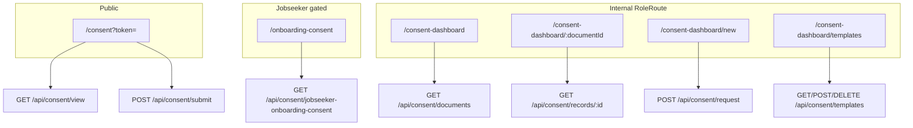

# Consent Management & Training — Marketing Technical Report

**Product framing (accurate):** Consent is a **token-linked e-consent workflow** (PDF review, typed full legal name, required agreement checkbox). It is **not** a canvas/cryptographic e-signature product. Optional **PDF autofill** stamps name and date onto template fields using `pdf-lib`.

---

## Part 1: Consent Management

### 1.1 File inventory

#### Frontend — pages & modals

| Purpose | Path |
|---------|------|
| Public signing | [client/src/pages/Consent/ConsentPage.tsx](client/src/pages/Consent/ConsentPage.tsx) |
| Jobseeker onboarding signing (authenticated) | [client/src/pages/Consent/OnboardingConsent.tsx](client/src/pages/Consent/OnboardingConsent.tsx) |
| Internal document list | [client/src/pages/Consent/ConsentListPage.tsx](client/src/pages/Consent/ConsentListPage.tsx) |
| Per-document recipients & resend | [client/src/pages/Consent/ConsentDetailPage.tsx](client/src/pages/Consent/ConsentDetailPage.tsx) |
| Create bulk consent request | [client/src/pages/Consent/CreateConsentPage.tsx](client/src/pages/Consent/CreateConsentPage.tsx) |
| Template wizard (PDF field placement) | [client/src/pages/Consent/ConsentTemplatePage.tsx](client/src/pages/Consent/ConsentTemplatePage.tsx) |
| Recipient detail modal | [client/src/pages/Consent/ConsentRecordDetailModal.tsx](client/src/pages/Consent/ConsentRecordDetailModal.tsx) |
| Consent history on jobseeker profile | [client/src/pages/JobseekerManagement/JobSeekerProfile.tsx](client/src/pages/JobseekerManagement/JobSeekerProfile.tsx) |
| Consent history on client profile | [client/src/pages/ClientManagement/ClientView.tsx](client/src/pages/ClientManagement/ClientView.tsx) |
| Email previews (consent + employment agreement) | [client/src/pages/EmailTemplatePreview/EmailTemplatePreviewPage.tsx](client/src/pages/EmailTemplatePreview/EmailTemplatePreviewPage.tsx) |

#### Frontend — routing, API, access

| Purpose | Path |
|---------|------|
| Routes | [client/src/App.tsx](client/src/App.tsx) (`/consent`, `/onboarding-consent`, `/consent-dashboard/*`) |
| Role constants | [client/src/constants/accessControl.ts](client/src/constants/accessControl.ts) (`CONSENT_LIST_ROLES`, `CONSENT_CREATE_ROLES`) |
| API client | [client/src/services/api/consent.ts](client/src/services/api/consent.ts) |
| Auth/onboarding gates | [client/src/components/ProtectedRoute.tsx](client/src/components/ProtectedRoute.tsx) |
| Nav submenu | [client/src/components/HamburgerMenu.tsx](client/src/components/HamburgerMenu.tsx) |

#### Frontend — styles

- [client/src/styles/pages/ConsentPage.css](client/src/styles/pages/ConsentPage.css)
- [client/src/styles/pages/ConsentListAndDetailPage.css](client/src/styles/pages/ConsentListAndDetailPage.css)
- [client/src/styles/pages/CreateConsentPage.css](client/src/styles/pages/CreateConsentPage.css)
- [client/src/styles/pages/OnboardingConsent.css](client/src/styles/pages/OnboardingConsent.css)
- [client/src/styles/pages/ConsentTemplatePage.css](client/src/styles/pages/ConsentTemplatePage.css)
- [client/src/styles/components/ConsentRecordDetailModal.css](client/src/styles/components/ConsentRecordDetailModal.css)

#### Backend

| Purpose | Path |
|---------|------|
| All consent APIs | [server/src/routes/consent.ts](server/src/routes/consent.ts) (mounted at `/api/consent` in [server/src/index.ts](server/src/index.ts)) |
| Employment agreement on email confirm | [server/src/routes/auth.ts](server/src/routes/auth.ts) |
| Employment agreement on profile create | [server/src/routes/profile.ts](server/src/routes/profile.ts) |
| General consent email | [server/src/email-templates/consent-html.ts](server/src/email-templates/consent-html.ts) |
| Employment agreement email | [server/src/email-templates/employment-agreement-html.ts](server/src/email-templates/employment-agreement-html.ts) |
| Email template registry | [server/src/routes/emailTemplates.ts](server/src/routes/emailTemplates.ts) |
| Role middleware | [server/src/middleware/auth.ts](server/src/middleware/auth.ts) |

#### Database & storage migrations

- [server/src/db/migrations/20250827_create_digital_consent_tables.sql](server/src/db/migrations/20250827_create_digital_consent_tables.sql)
- [server/src/db/migrations/20260306_consent_autofill_and_templates.sql](server/src/db/migrations/20260306_consent_autofill_and_templates.sql)
- [server/src/db/migration_v2/009_consent.sql](server/src/db/migration_v2/009_consent.sql)
- [server/src/db/migration_v2/017_jobseeker_onboarding_consent.sql](server/src/db/migration_v2/017_jobseeker_onboarding_consent.sql)
- Storage policies: `20250827_consent_storage_policies.sql`, `20250128_update_consent_storage_policies.sql`, `20250128_fix_consent_read_policy.sql`

**Note:** `docs/digital-consent-feature-guide.md` references a `client/src/components/consent/` folder that **does not exist**; logic lives in page components.

---

### 1.2 Routes map



---

### 1.3 Main user flows (step-by-step)

#### A. Manual consent request (internal → client or jobseeker)

1. User with **Create Consent** menu access opens `/consent-dashboard/new` ([CreateConsentPage.tsx](client/src/pages/Consent/CreateConsentPage.tsx)).
2. Uploads PDF (or selects template for autofill mode) to Supabase bucket `consent-documents` under `{userId}/{documentId}/...`.
3. Selects recipients (`client` or `jobseeker_profile` IDs) and optional autofill template/fields.
4. Submits → `POST /api/consent/request`.
5. **Server writes:** `consent_documents` row; one `consent_records` row per recipient (`status: pending`, unique 64-char hex `consent_token`).
6. **Email:** SendGrid via `emailNotifier` — subject/body from [consent-html.ts](server/src/email-templates/consent-html.ts); link `{CLIENT_URL}/consent?token={token}`.
7. **Activity log:** `create_consent_request` in `recent_activities`.
8. On per-recipient insert failure, document row is rolled back.

#### B. Public signing (`/consent?token=`)

1. Recipient opens email link (no login).
2. `GET /api/consent/view?token=` returns document metadata, entity name, status.
3. PDF loaded via **5-minute Supabase signed URL**; rendered with `react-pdf` (zoom, paging).
4. If `status === completed` → read-only completion panel (name, completed time).
5. If `status === expired` → expired message (see §1.6 — status rarely set server-side).
6. Else: recipient enters **full name**, checks **required agreement checkbox**, submits → `POST /api/consent/submit`.
7. Success UI; revisiting shows completed state.

#### C. Employment agreement (automatic jobseeker onboarding)

**Prerequisites:** Active `consent_document_templates` row with `template_name = 'employmentAgreement'`; shared onboarding `consent_documents` row with `is_jobseeker_onboarding = true`.

**Triggers (each creates/uses `consent_records` with `consentable_type = 'user'`, `is_jobseeker_onboarding = true`, autofill mode):

| Trigger | Code location | Email |
|---------|---------------|-------|
| Jobseeker confirms email (self-signup) | [auth.ts](server/src/routes/auth.ts) ~844–931 | Welcome + employment agreement |
| Recruiter creates jobseeker profile | [profile.ts](server/src/routes/profile.ts) ~510–597 | Employment agreement only |
| Jobseeker visits onboarding UI / first API fetch | `GET /api/consent/jobseeker-onboarding-consent` | Only when **new** record created |

**After sign:** `auth.users.user_metadata.employment_agreement_signed = true`. [ProtectedRoute.tsx](client/src/components/ProtectedRoute.tsx) blocks all other jobseeker routes until signed; only `/onboarding-consent` allowed beforehand.

**Signing UX:** Same token link as general consent **or** authenticated [OnboardingConsent.tsx](client/src/pages/Consent/OnboardingConsent.tsx) (header, employment-specific copy).

#### D. Internal status tracking

1. **Dashboard:** `/consent-dashboard` → `GET /api/consent/documents` (paginated, filters; excludes onboarding-only documents).
2. **Detail:** `/consent-dashboard/:documentId` → `GET /api/consent/records/:documentId` — per-recipient status, name, email, filled PDF paths.
3. **Profile tabs:** Jobseeker/client views call `GET /api/consent/entity-records/:consentableId?consentableType=...`.
4. **Activity feed:** `RecentActivities` shows `create_consent_request`, `user_consent_given`, `resend_consent_request`.

#### E. Resend / reminder

1. On detail page, staff multi-selects pending (or any) rows → “Resend Consent Email”.
2. `POST /api/consent/resend` with `{ recordIds: [] }`.
3. Updates `sent_at` to now; resends same consent email template; logs `resend_consent_request`.
4. **Same token** — no regeneration. **No scheduled/cron reminders.** **No filter** excluding already-completed records.

#### F. Consent templates

1. Superadmin opens `/consent-dashboard/templates` ([ConsentTemplatePage.tsx](client/src/pages/Consent/ConsentTemplatePage.tsx)) — wizard: upload PDF, click to place name/date fields (`field_mappings` JSON).
2. `POST /api/consent/templates` stores row in `consent_document_templates`.
3. Special template name `employmentAgreement` powers onboarding automation.
4. Autofill requests reference `template_id`; on sign, server generates per-recipient PDF → `filled-consents/{recordId}/...` in storage.

---

### 1.4 Role access (frontend vs backend)

#### Frontend guards ([accessControl.ts](client/src/constants/accessControl.ts) + [App.tsx](client/src/App.tsx))

| Surface | Allowed roles (exact match via `RoleRoute` / menu) |
|---------|---------------------------------------------------|
| List + detail (`CONSENT_LIST_ROLES`) | `admin`, `recruiter`, `recruiter_manager`, `recruiter_director` |
| Create (`CONSENT_CREATE_ROLES`) | Same as list |
| Templates route | `SuperAdminRoute` — `user_metadata.user_role` includes `superadmin` |
| Templates menu item | `requiresSuperAdmin: true` (submenu still lists `roles: ["admin"]` but superadmin flag gates it) |
| Public `/consent` | None |
| `/onboarding-consent` | Authenticated jobseeker (via `ProtectedRoute`) |

**Not in consent UI:** `bookkeeper`, `accountant_manager`, `sales` (though backend may allow them — see below).

#### Backend `authorizeRoles` / other guards ([consent.ts](server/src/routes/consent.ts))

| Endpoint | Guard |
|----------|-------|
| `GET/POST/DELETE /templates` | `admin` list/create/delete; `recruiter` list only |
| `GET /documents`, `GET /records/:id`, `POST /resend` | `authorizeRoles(['admin', 'recruiter'])` |
| `POST /request` | `requireSuperAdmin` — `user_role` array must include **`superadmin`** |
| `GET /view`, `POST /submit` | Public (token) |
| `GET /entity-records/:id` | `authenticateToken` only — **no role check** |
| `GET /jobseeker-onboarding-consent` | Authenticated + `user_type === jobseeker` |

**`authorizeRoles(['recruiter'])` expansion:** In [auth.ts](server/src/middleware/auth.ts), `hasAccessRole(..., 'recruiter')` is true for `bookkeeper`, `recruiter_manager`, `accountant_manager`, `sales`, `recruiter_director` — so those roles **can call list/resend APIs** even when the hamburger menu hides Consent Management (menu uses **exact** role lists).

#### Documented mismatches (flag for marketing accuracy)

| Issue | Frontend | Backend |
|-------|----------|---------|
| **Create consent** | Recruiters/managers see Create page | **`POST /request` requires `superadmin` in `user_role`** — others get 403 |
| **Templates** | Superadmin-only route | Create/delete requires **`admin`** (not superadmin-specific) |
| **Recruiter umbrella** | Menu limited to 4 roles | API `recruiter` includes bookkeeper, sales, etc. |
| **Entity records** | Used from profile pages | Any authenticated user with UUID can call endpoint |
| **RLS policies** | N/A | Legacy `user_type IN ('admin','recruiter')`; server uses service role and bypasses RLS for API |

---

### 1.5 Database writes & side effects

#### Tables

| Table | Role |
|-------|------|
| `consent_document_templates` | Reusable PDF + `field_mappings` (name/date positions) |
| `consent_documents` | Per campaign or shared onboarding doc (`consent_mode`, `template_id`, `is_jobseeker_onboarding`, etc.) |
| `consent_records` | Per recipient: token, status, audit fields, optional filled PDF paths |

#### On sign (`POST /api/consent/submit`)

Updates `consent_records`:

- `status` → `'completed'`
- `completed_at` → ISO timestamp
- `consented_name` → trimmed typed name (min 2 chars)
- `ip_address` → `x-forwarded-for` → `x-real-ip` → `cf-connecting-ip` → `req.ip`
- `filled_document_file_path` / `filled_document_file_name` — only if `consent_mode === 'autofill'`

**Also:**

- Activity: `user_consent_given` (metadata includes IP, entity type, document version)
- If onboarding + `consentable_type === 'user'`: `employment_agreement_signed: true` in auth metadata
- Autofill: PDF generated/uploaded to storage

**Not stored:** signature image, user-agent, separate checkbox timestamp, email verification at sign time, document hash.

**Not shown in UI:** IP is stored but [ConsentRecordDetailModal.tsx](client/src/pages/Consent/ConsentRecordDetailModal.tsx) does not display it.

#### Storage

- Bucket: `consent-documents` (private; anon SELECT policies exist for signing — broad if path known)
- Filled PDFs: `filled-consents/{recordId}/...`

---

### 1.6 Working vs partial vs stubbed

| Capability | Status |
|------------|--------|
| Public token view + submit with audit fields | **Working** |
| Internal list/detail, filters, i18n (en/fr) | **Working** |
| Manual email send + resend | **Working** (resend lacks pending-only guard) |
| PDF autofill templates + per-recipient filled PDF | **Working** |
| Employment agreement automation + portal gate | **Working** (requires `employmentAgreement` template configured) |
| Activity feed integration | **Working** |
| Typed name + checkbox consent | **Working** (not drawn signature) |
| `expired` status + email copy about expiry | **Partial** — UI/DB allow `expired`; **no code sets it**; **no token TTL enforcement** on view/submit |
| Recruiter self-serve create | **Partial** — UI yes, API superadmin-only |
| Non-PDF uploads | **Partial** — bucket allows Office/images; public UI is PDF-only |
| Scheduled reminders | **Not built** |
| Rate limiting on public endpoints | **Commented out** |
| Separate `components/consent/` module | **Not built** (docs only) |

---

### 1.7 Buyer-relevant automated behaviors

- **Employment agreement pipeline:** Auto-creates consent record and emails link when jobseeker confirms email, when recruiter creates profile, or on first onboarding fetch; **blocks entire jobseeker portal** until signed.
- **PDF autofill:** Template-driven name/date stamping; archived filled copy per signer.
- **Bulk outreach:** One document → many recipients, each with unique token and email.
- **Audit trail:** IP + timestamp + typed legal name; activity feed for ops visibility.
- **Profile integration:** Consent history embedded on jobseeker and client records with link to dashboard detail.

**Do not claim:** legally binding e-signature pad, automatic link expiry enforcement, recruiter-initiated create without superadmin API access, automated reminder cadence, or compliance reporting from consent alone.

---

## Part 2: Training Modules

### 2.1 File inventory

| Purpose | Path |
|---------|------|
| Main page | [client/src/pages/TrainingModules/index.tsx](client/src/pages/TrainingModules/index.tsx) |
| YouTube player modal | [client/src/pages/TrainingModules/VideoModal.tsx](client/src/pages/TrainingModules/VideoModal.tsx) |
| Placeholder modal | [client/src/pages/TrainingModules/ComingSoonModal.tsx](client/src/pages/TrainingModules/ComingSoonModal.tsx) |
| Route | [client/src/App.tsx](client/src/App.tsx) — `/training-modules` under `ProtectedRoute` only |
| Menu gating | [client/src/components/HamburgerMenu.tsx](client/src/components/HamburgerMenu.tsx) — `TRAINING_ROLES` |
| Access constant | [client/src/constants/accessControl.ts](client/src/constants/accessControl.ts) — `TRAINING_ROLES = [...INTERNAL_STAFF_ROLES, "jobseeker"]` |
| Styles | [client/src/styles/pages/TrainingModules.css](client/src/styles/pages/TrainingModules.css), [client/src/styles/components/training/VideoModal.css](client/src/styles/components/training/VideoModal.css), [client/src/styles/components/training/ComingSoonModal.css](client/src/styles/components/training/ComingSoonModal.css) |
| i18n | [client/src/contexts/language/locales/en.json](client/src/contexts/language/locales/en.json), `fr.json` — keys under `training.*` |
| Docs (not wired to app) | [docs/training-video-details.md](docs/training-video-details.md) (YouTube IDs **differ** from app) |

**No server files:** Zero `training` references under [server/src](server/src). No migrations, no `authorizeRoles` training endpoints, no API client in `client/src/services`.

---

### 2.2 Content catalog (hardcoded in `index.tsx`)

| ID | Module | Type | Status | YouTube ID | Mandatory badge |
|----|--------|------|--------|------------|-----------------|
| tm-001 | AODA Training | video | **Working** | `3uXKmNbTZos` | Yes (UI only) |
| tm-002 | Workplace Violence & Harassment | video | **Working** | `O615tiZ6eOk` | Yes (UI only) |
| tm-003 | WHMIS Training | video | **Working** | `H8pKkyP9FvY` | No |
| tm-004 | Health & Safety Training | video | **Working** | `cuZ8xNY4TWo` | No |
| tm-005 | Effective Resume Screening | document | **Coming soon** | — | No |
| tm-006 | Interview Techniques | interactive | **Coming soon** | — | No |
| tm-007 | Client Management Essentials | document | **Coming soon** | — | No |
| tm-008 | Job Seeker Resume Building | interactive | **Coming soon** | — | No |

Comment in source: *"In a real application, this would come from an API."*

**Coming soon behavior:** Opens [ComingSoonModal.tsx](client/src/pages/TrainingModules/ComingSoonModal.tsx) with static feature bullets and “We’ll notify you” copy — **no notification system exists**.

---

### 2.3 Page structure & UX

- Header via `AppHeader`; back button uses `navigate(-1)`.
- Category filters: all / video / document / interactive.
- Search over translated title + description.
- Card grid → video cards open `VideoModal` with YouTube iframe (`autoplay=1`).
- Per-module route (`/training-modules/:id`) is **commented out** — not implemented.

---

### 2.4 User flows

#### Internal staff (`INTERNAL_STAFF_ROLES`: admin, recruiter, bookkeeper, recruiter_manager, accountant_manager, sales, recruiter_director)

1. Login, complete onboarding.
2. Hamburger → **Training** (if exact role in `TRAINING_ROLES`).
3. Browse/filter/search → open video → watch in modal → close.

#### Jobseeker (verified)

1. Must have signed employment agreement.
2. Profile verified → menu shows Training.
3. Same browse/watch flow.

#### Jobseeker (pending/rejected verification)

- Menu **hidden**, but `/training-modules` is a **utility route** in [ProtectedRoute.tsx](client/src/components/ProtectedRoute.tsx) — direct URL works while verification pending/rejected.

#### Jobseeker (no profile / unsigned agreement)

- No training until profile exists and employment agreement signed.

---

### 2.5 Role access

| Layer | Behavior |
|-------|----------|
| `ProtectedRoute` | Any authenticated user passing jobseeker gates can hit `/training-modules` |
| `RoleRoute` | **Not used** for training |
| Menu | `TRAINING_ROLES` via exact role match |
| Backend | **None** |

**Mismatch:** Users outside `TRAINING_ROLES` (e.g. metadata-only configurations) may lack menu item but could open `/training-modules` if they pass `ProtectedRoute`.

**Mandatory training:** Badge on tm-001/tm-002 only — **no enforcement** on dashboard, positions, timesheets, or portal access.

---

### 2.6 Completion tracking

**Not meaningful — cosmetic only.**

- Every module has `completed: false` hardcoded; nothing ever sets `true`.
- No `localStorage`, API, or database.
- “Completed” badge UI exists but **never appears**.
- ComingSoonModal mentions progress tracking/certificates — **placeholder copy only**.

---

### 2.7 Working vs partial vs stubbed

| Item | Status |
|------|--------|
| Four compliance/safety YouTube videos | **Working** |
| Catalog UI (search, filters, i18n) | **Working** |
| Four additional modules | **Coming soon stub** |
| CMS / API-driven catalog | **Stubbed** |
| Completion persistence | **Stubbed** |
| Mandatory enforcement | **Stubbed** |
| Notifications for coming soon | **Stubbed** |
| Per-module detail pages | **Not built** |
| Compliance reporting | **Not built** |

---

### 2.8 Buyer-relevant honest positioning

**Safe to say:** In-app training library with four embedded compliance/safety videos (AODA, workplace violence/harassment, WHMIS, health & safety), bilingual UI, browsable catalog for staff and verified jobseekers.

**Do not say:** LMS with completion tracking, mandatory training enforcement, certificates, scheduled assignments, or the four “coming soon” modules as available content.

---

## Part 3: Quick API reference (consent only)

```
GET    /api/consent/templates              [admin, recruiter*]
POST   /api/consent/templates              [admin]
DELETE /api/consent/templates/:id          [admin]
GET    /api/consent/documents              [admin, recruiter*]
GET    /api/consent/records/:documentId    [admin, recruiter*]
POST   /api/consent/request                [superadmin in user_role]
POST   /api/consent/resend                 [admin, recruiter*]
GET    /api/consent/view?token=            [public]
POST   /api/consent/submit                 [public]
GET    /api/consent/entity-records/:id     [authenticated, any role]
GET    /api/consent/jobseeker-onboarding-consent [jobseeker]

* recruiter includes bookkeeper, recruiter_manager, accountant_manager, sales, recruiter_director via hasAccessRole
```
