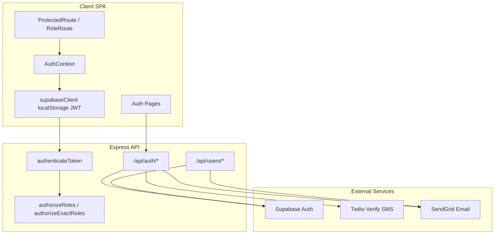
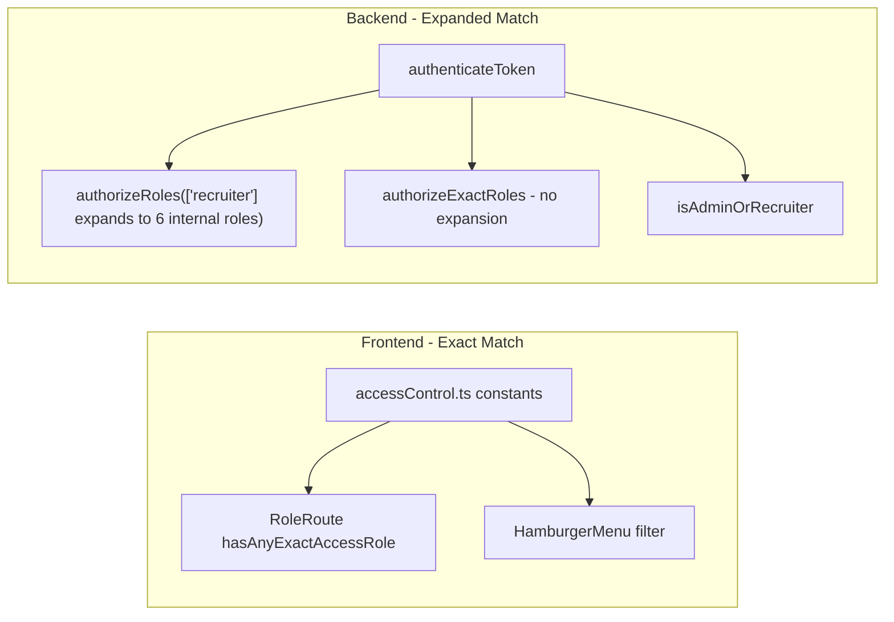

# Core Platform — Functional & Technical Summary

**Stack:** React (Vite) SPA + Express API + Supabase Auth. No Next.js middleware; protection is client-side route guards plus Bearer JWT on API routes.

**Primary references:** [docs/role-access-control.md](role-access-control.md), [client/src/constants/accessControl.ts](../client/src/constants/accessControl.ts), [server/src/middleware/auth.ts](../server/src/middleware/auth.ts), [server/src/routes/auth.ts](../server/src/routes/auth.ts), [server/src/routes/user.ts](../server/src/routes/user.ts)

---

## Architecture Overview

---

## 1. Authentication & Account Lifecycle

### Key files

| Layer | Paths |
|-------|-------|
| Pages | [client/src/pages/Authentication/Login.tsx](../client/src/pages/Authentication/Login.tsx), [Signup.tsx](../client/src/pages/Authentication/Signup.tsx), [ForgotPassword.tsx](../client/src/pages/Authentication/ForgotPassword.tsx), [ResetPassword.tsx](../client/src/pages/Authentication/ResetPassword.tsx), [VerificationPending.tsx](../client/src/pages/Authentication/VerificationPending.tsx), [EmailConfirmed.tsx](../client/src/pages/Authentication/EmailConfirmed.tsx) |
| Context / lib | [client/src/contexts/AuthContext.tsx](../client/src/contexts/AuthContext.tsx), [client/src/lib/auth.ts](../client/src/lib/auth.ts), [client/src/lib/supabaseClient.ts](../client/src/lib/supabaseClient.ts) |
| API client | [client/src/services/api/auth.ts](../client/src/services/api/auth.ts), [client/src/services/api/index.ts](../client/src/services/api/index.ts) |
| Routes | [client/src/App.tsx](../client/src/App.tsx) |
| Server | [server/src/routes/auth.ts](../server/src/routes/auth.ts), [server/src/middleware/auth.ts](../server/src/middleware/auth.ts) |

### Login flow (step-by-step)

1. User submits email + password on `/login`.
2. Client calls `POST /api/auth/validate-credentials` (not the legacy `/api/auth/login` endpoint).
3. **Server credential check:**
   - If email contains `@godspeedxp`, `@motionfalcon`, `@canhiresolutions`, `@allstaff`, or `@hdgroup`: validates password via Supabase sign-in, then **immediately signs out** server-side and returns `requiresTwoFactor: true` with user object (no session).
   - Otherwise: normal sign-in; returns full **session** + user.
4. Client checks `email_confirmed_at` / `emailVerified`; if unverified → redirect `/verification-pending`.
5. Client checks `user_metadata.user_type`:
   - **`recruiter` or `admin`:** requires `user_metadata.phoneNumber`; navigates to `/two-factor-auth` with credentials in React Router state.
   - **Others:** session already set → `/dashboard`.
6. After 2FA (internal users only): Twilio OTP → `POST /api/auth/complete-2fa` → client `setSession` → `/dashboard`.
7. `ProtectedRoute` then applies onboarding and jobseeker gates (see Section 3).

### Staff vs jobseeker distinction

The platform uses **two separate mechanisms** that do not always agree:

| Mechanism | Where set | Effect |
|-----------|-----------|--------|
| **`user_metadata.user_type`** | Account creation (register, invite, admin script, recruiter-created profile) | Drives route guards, 2FA UI branch, jobseeker onboarding gates |
| **Email domain lists** | Hard-coded in server/client | Only affects `/validate-credentials` session discard path |

**At account creation:**

- **Self-registration** (`POST /api/auth/register`): default `user_type: jobseeker`. Only `@godspeedxp` or `@motionfalcon` emails become `recruiter`.
- **Staff invite** (`POST /api/users/invite-recruiter`): always `user_type: recruiter`, `user_role: ['recruiter']`, `onboarding_complete: false`.
- **Recruiter-created jobseeker** (profile API): `user_type: jobseeker`, personal email, email pre-confirmed.

**At login:**

- Server 2FA credential path uses **5 corporate domains** (above).
- Client 2FA redirect uses **`user_type === recruiter | admin`**, not email domain.
- A user who self-registers with `@canhiresolutions` email gets `user_type: jobseeker` but may hit the server corporate-email path — they receive a full session and skip 2FA.

### Email verification flow

**Jobseeker self-signup:**
1. `Signup.tsx` → `POST /api/auth/register` → Supabase `signUp` with `emailRedirectTo: {CLIENT_URL}/email-confirmed`.
2. Navigate `/verification-pending`.
3. User clicks Supabase link → `/email-confirmed` exchanges tokens → `POST /api/auth/send-confirmation-welcome` (welcome + employment agreement emails; sets `welcome_email_sent: true`) → **signs out** so user must log in again.
4. Resend: `POST /api/auth/resend-verification`.

**Unverified login:** Server catches "Email not confirmed", looks up user via `admin.listUsers()`, returns `emailVerified: false` without session.

**Staff invite:** Supabase invite email; confirmation embedded in invite flow. `/complete-signup` accepts invite tokens from URL hash.

### Password reset flow

1. `/forgot-password` → client-side `supabase.auth.resetPasswordForEmail` with `redirectTo: {origin}/reset-password` (does **not** use server `POST /api/auth/reset-password`).
2. `/reset-password` parses recovery hash/query tokens.
3. Submit → `updatePasswordWithResetToken()` (active session, hash tokens, or `POST /api/auth/update-password` fallback).
4. Success → sign out → `/login`.

### Session management

| Aspect | Behavior |
|--------|----------|
| Provider | Supabase Auth |
| Storage | Supabase JS default (**localStorage**), not HTTP-only cookies |
| API auth | `Authorization: Bearer <access_token>` via axios interceptor |
| Token cache | ~`expires_in - 300s` (default ~3600s) |
| Server validation | `supabase.auth.getUser(token)` with anon key |
| Refresh | `AuthContext` calls `getSession()` / `getUser()` on load and auth state changes |
| Remember me | Checkbox exists; **does not change session duration** in code |
| Logout | Client `signOut()` + localStorage clear + full page reload |
| Expiry | Governed by **Supabase project settings**, not repo config |

### Database writes & side effects

**Supabase `auth.users` fields commonly written:**

- Core: `email`, `password`, `phone`, `email_confirmed_at`
- Metadata: `name`, `user_type`, `user_role[]`, `hierarchy`, `phoneNumber`, `phone_verified`, `onboarding_complete`, `hasProfile`, `welcome_email_sent`, `setup_reminder_sent`, `employment_agreement_signed`, `portal_name`

**App tables (auth-adjacent):**

- `recent_activities` — registration, invite, complete onboarding (via `activityLogger`)
- `consent_documents` / `consent_records` — employment agreement on welcome email
- `jobseeker_profiles` — verification status (jobseeker gates)

### Status

| Feature | Status |
|---------|--------|
| Jobseeker login + session | **Working** |
| Staff login + 2FA UI | **Working** (with gaps below) |
| Email verification + welcome emails | **Working** (SendGrid env required) |
| Password reset | **Working** |
| Legacy `POST /api/auth/login` | **Unused** by UI |
| Server `POST /api/auth/reset-password` | **Unused** by forgot-password page |
| Domain list consistency | **Partial** — 3 different lists across register / validate-credentials / client helper |
| Remember me duration | **Not implemented** |

---

## 2. Two-Factor Authentication (2FA)

### Key files

- [client/src/pages/Authentication/TwoFactorAuth.tsx](../client/src/pages/Authentication/TwoFactorAuth.tsx)
- [server/src/routes/auth.ts](../server/src/routes/auth.ts) — `/send-verification`, `/verify-otp`, `/complete-2fa`, `/validate-credentials`

### Provider

**Twilio Verify — SMS only.** No TOTP/authenticator app support.

Env: `TWILIO_*` variables; returns 500 if not configured.

### Step-by-step flow (internal users)

1. Login validates credentials (see Section 1).
2. Client detects `user_type === recruiter | admin` and `phoneNumber` present.
3. Navigate `/two-factor-auth`; auto `POST /api/auth/send-verification` → Twilio SMS.
4. User enters OTP → `POST /api/auth/verify-otp` (Twilio check; optionally updates `auth.users.phone` if `userId` passed).
5. `POST /api/auth/complete-2fa` with email + password → Supabase sign-in → session returned → `setSession` → `/dashboard`.

### Required vs optional

| User | 2FA |
|------|-----|
| `user_type` **recruiter** or **admin** with `phoneNumber` | **Required** at login (client blocks login if phone missing) |
| Same users without `phoneNumber` | **Blocked** — error shown |
| **bookkeeper**, **recruiter_manager**, **accountant_manager**, **sales**, **recruiter_director** | Not in client 2FA branch — **no 2FA page** unless `user_type` is recruiter/admin |
| **jobseeker** | **No 2FA** |
| Corporate email but `user_type: jobseeker` (self-signup edge case) | Server may discard session; client skips 2FA and may not restore session correctly |

### Security note (factual, for accuracy)

`POST /api/auth/complete-2fa` re-authenticates with email/password only — it does **not** verify that OTP was completed server-side. OTP enforcement is client-side only.

### Status

| Aspect | Status |
|--------|--------|
| Twilio SMS send/verify | **Working** |
| 2FA UI flow | **Working** for recruiter/admin with phone |
| Server OTP binding to session creation | **Not implemented** |
| TOTP/authenticator | **Not present** |
| Consistent 2FA rules (domain vs user_type) | **Partial** |

---

## 3. Onboarding Flows

### Key files

| Flow | Paths |
|------|-------|
| Staff invite UI | [client/src/pages/RecruiterManagement/InviteRecruiter.tsx](../client/src/pages/RecruiterManagement/InviteRecruiter.tsx) |
| Complete signup | [client/src/pages/Authentication/CompleteSignup.tsx](../client/src/pages/Authentication/CompleteSignup.tsx) |
| Jobseeker signup | [client/src/pages/Authentication/Signup.tsx](../client/src/pages/Authentication/Signup.tsx) |
| Employment agreement | [client/src/pages/Consent/OnboardingConsent.tsx](../client/src/pages/Consent/OnboardingConsent.tsx) |
| Profile create | [client/src/pages/JobseekerProfile/ProfileCreate.tsx](../client/src/pages/JobseekerProfile/ProfileCreate.tsx) |
| Route gates | [client/src/components/ProtectedRoute.tsx](../client/src/components/ProtectedRoute.tsx) |
| Invite API | [server/src/routes/user.ts](../server/src/routes/user.ts) — `invite-recruiter`, `resend-invitation` |
| Onboarding API | [server/src/routes/auth.ts](../server/src/routes/auth.ts) — `complete-onboarding`, `send-confirmation-welcome`, `first-login-reminder` |
| Email templates | [server/src/email-templates/onboarding-reminder-html.ts](../server/src/email-templates/onboarding-reminder-html.ts), [recruiter-invitation-html.ts](../server/src/email-templates/recruiter-invitation-html.ts) |

### Internal staff invite flow

**Who can invite (UI):** `admin`, `recruiter_manager`, `accountant_manager`, `recruiter_director` — route `/invite-recruiter`

**Who can invite (API):** **`admin` only** — mismatch (see Section 4)

**Steps:**
1. Admin (or manager with UI access) enters name + email on `/invite-recruiter`.
2. `POST /api/users/invite-recruiter` → Supabase `inviteUserByEmail` with redirect to `/complete-signup`.
3. Invitee receives Supabase invitation email (template configured in Supabase dashboard; sample in repo email templates).
4. User metadata created: `user_type: recruiter`, `user_role: ['recruiter']`, `onboarding_complete: false`, empty `hierarchy`, `phone_verified: false`.
5. Activity logged: `invite_recruiter` → `recent_activities`.

**Note:** Product docs reference "Invite Recruiter/Accountant" but only **recruiter invite** is implemented — no separate accountant invite endpoint.

### `/complete-signup` flow (invited staff)

1. Public route (not behind `ProtectedRoute`).
2. Parse invite tokens from URL hash/query (`type=invite`) or use existing session → `setSession`.
3. Expired invite → error UI.
4. Phone availability check + Twilio OTP (same APIs as signup).
5. Submit → `POST /api/auth/complete-onboarding` (Bearer from invite session):
   - Sets password (min 8 chars)
   - Updates `phoneNumber`, `phone_verified`, `onboarding_complete: true`
   - Writes `auth.users.phone`
6. Activity: `complete_onboarding` → `recent_activities`.
7. Success → user navigates to `/login` manually.

**Gate:** Until `onboarding_complete: true`, `ProtectedRoute` treats user as not authenticated → cannot access app routes.

### Jobseeker self-registration

1. `/signup` (public) — debounced `GET /api/auth/check-email`, `GET /api/auth/check-phone`.
2. Twilio OTP verification during form (client-side `isPhoneVerified` flag).
3. `POST /api/auth/register` → Supabase signUp, default `user_type: jobseeker`.
4. Navigate `/verification-pending`.
5. Email confirm → `/email-confirmed` → welcome + employment agreement emails.
6. First login → auto `POST /api/auth/first-login-reminder` if no profile yet (see Section 5).

### Gates before full access

**All users:**
- `onboarding_complete === false` → blocked from protected routes (redirect `/login`)

**Internal staff (post-login):**
- Email verified
- 2FA completed (recruiter/admin with phone)
- Role-based page access via `RoleRoute`

**Jobseekers (sequential gates in `ProtectedRoute`):**

| Gate | Condition | Allowed routes |
|------|-----------|----------------|
| Employment agreement | `employment_agreement_signed !== true` | `/onboarding-consent` only |
| No profile | `hasProfile === false` | `/profile/create` only |
| Pending verification | `verification_status === 'pending'` | `/profile-verification-pending`, utilities |
| Rejected | `verification_status === 'rejected'` | rejected page, profile edit, utilities |
| Verified | `verification_status === 'verified'` | full jobseeker app |

Profile status fetched from `jobseeker_profiles` via `AuthContext`.

### Status

| Flow | Status |
|------|--------|
| Jobseeker self-registration + email verify | **Working** |
| Invited staff complete-signup | **Working** |
| Supabase invite email | **Working** |
| Invite UI for non-admin managers | **Partial** — UI visible, API returns 403 |
| Accountant invite | **Not implemented** |

---

## 4. Role-Based Access Control

### The 8 roles (exact names)

Stored in Supabase `user_metadata`:
- **`user_type`:** `admin` | `recruiter` | `jobseeker`
- **`user_role[]`:** sub-roles when `user_type === recruiter`

| # | Role | Resolution | High-level access (core platform pages) |
|---|------|------------|----------------------------------------|
| 1 | **`admin`** | `user_type === admin` | Full portal; All Users; hierarchy; role assignment; invites (API); dropdown CRUD |
| 2 | **`recruiter_director`** | `user_role[]` | All Users; hierarchy view; role assignment; invite UI; reports |
| 3 | **`recruiter_manager`** | `user_role[]` | Invite UI (not API); dropdown options page |
| 4 | **`accountant_manager`** | `user_role[]` | Invite UI (not API); dropdown options page |
| 5 | **`bookkeeper`** | `user_role[]` | Dashboard, calendar, training, AI chat (no user-management pages) |
| 6 | **`sales`** | `user_role[]` | Dashboard, calendar, training, AI chat |
| 7 | **`recruiter`** | `user_role[]` or default for recruiter accounts | Dashboard, calendar, training, AI chat |
| 8 | **`jobseeker`** | `user_type === jobseeker` | Own profile/onboarding; dashboard; training |

**Legacy aliases:** `manager` → `recruiter_manager`, `accountant` → `bookkeeper`

**Extra (not one of 8):** `superadmin` in `user_role[]` unlocks consent template admin UI via `SuperAdminRoute` — separate from `admin` user_type.

### Enforcement model

**Frontend:** `RoleRoute` uses **exact** role matching — no `recruiter` expansion.

**Backend:** `authorizeRoles(['recruiter'])` expands `recruiter` to: `recruiter`, `bookkeeper`, `recruiter_manager`, `accountant_manager`, `sales`, `recruiter_director`.

### Recruiter hierarchy

**What it is:** Reporting structure in `user_metadata.hierarchy`:
- `manager_id`, `org_id`, `team_id`, `level`

**Management:**
- **Assign manager:** All Users page → `PATCH /api/users/:id/manager` — cycle detection, jobseekers cannot be managers
- **View org chart:** `/recruiter-hierarchy` — read-only accordion tree from admin + recruiter users

**Who can access hierarchy UI:** `admin`, `recruiter_director` (`RECRUITER_HIERARCHY_ROLES`)

**Who can set manager (UI):** Anyone on All Users page (admin + recruiter_director only can reach page)

**Who can set manager (API):** `isAdminOrRecruiter` — all 6 expanded internal roles

### Frontend vs backend mismatches (core platform)

| Area | Frontend | Backend | Gap |
|------|----------|---------|-----|
| Invite recruiter | `admin`, `recruiter_manager`, `accountant_manager`, `recruiter_director` | `authorizeRoles(['admin'])` only | Managers/directors see UI; **403 on submit** |
| Resend invitation | All Users page (admin + director) | `authorizeRoles(['admin'])` only | Directors get **403** on "Invite again" |
| List users | All Users: admin + director | `isAdminOrRecruiter` | Bookkeeper, sales, plain recruiter can call API without UI |
| Set roles | admin + director (inner check aligned) | Outer middleware `isAdminOrRecruiter` | Broader API access than page |
| Set manager | admin + director (page access) | `isAdminOrRecruiter` | Broader API access than page |
| Dropdown options page | admin, recruiter_manager, accountant_manager, recruiter_director | GET: admin + expanded recruiter; POST/PUT/DELETE: **admin only** | Managers see page; **cannot mutate** |
| Consent templates UI | `superadmin` in metadata | POST/DELETE: **admin only** | Superadmin UI vs admin-only API |

### Core platform route guards ([client/src/App.tsx](../client/src/App.tsx))

| Route | Frontend roles |
|-------|----------------|
| `/all-users-management` | `admin`, `recruiter_director` |
| `/recruiter-hierarchy` | `admin`, `recruiter_director` |
| `/invite-recruiter` | `admin`, `recruiter_manager`, `accountant_manager`, `recruiter_director` |
| `/admin/dropdown-options` | `admin`, `recruiter_manager`, `accountant_manager`, `recruiter_director` |

---

## 5. User Management (Internal)

### Key files

- [client/src/pages/AllUsersManagement.tsx](../client/src/pages/AllUsersManagement.tsx)
- [client/src/pages/RecruiterHierarchy.tsx](../client/src/pages/RecruiterHierarchy.tsx)
- [client/src/pages/RecruiterManagement/InviteRecruiter.tsx](../client/src/pages/RecruiterManagement/InviteRecruiter.tsx)
- [client/src/services/api/user.ts](../client/src/services/api/user.ts)
- [server/src/routes/user.ts](../server/src/routes/user.ts)

### All Users view

**Route:** `/all-users-management`

**Who can see (UI):** `admin`, `recruiter_director`

**What it shows:** Paginated table of all auth users (jobseekers, admins, recruiters):
- Name (+ "Invited" badge if `onboarding_complete === false`)
- Email, phone
- Role badges (editable for recruiter accounts if `canAssignRoles`)
- Email verified status
- Manager (assignable for `user_type === recruiter`)
- Created date
- Last sign-in **or** "Invite again" button for incomplete onboarding

**Filters:** Global search, per-column filters, pagination.

**API:** `GET /api/users` via `list_auth_users` RPC — middleware `isAdminOrRecruiter` (broader than page access).

### Role assignment

| Layer | Who |
|-------|-----|
| Frontend | `canAssignRoles = isAdmin \|\| recruiter_director` |
| Backend inner check | Same — 403 otherwise |
| Assignable roles | `recruiter`, `bookkeeper`, `recruiter_manager`, `accountant_manager`, `sales`, `recruiter_director` |
| Restrictions | Cannot assign `admin`; cannot modify admin users |

**API:** `PATCH /api/users/:id/roles` → writes `user_metadata.user_role[]`

### Recruiter hierarchy management

- **Setup:** All Users page — manager dropdown per recruiter user
- **View:** Recruiter Hierarchy page — org chart grouped by admin roots and manager chains
- **Validation:** Cycle detection, jobseekers cannot be managers
- **DB write:** `user_metadata.hierarchy.manager_id`

### Inviting team members

See Section 3. **Working for admin only at API level.**

### Onboarding reminder emails

| Trigger | Who initiates | Endpoint | When sent |
|---------|---------------|----------|-----------|
| **Resend from All Users** | UI: admin/director; API: **admin only** | `POST /api/users/resend-invitation` | `onboarding_complete !== true` |
| — If email confirmed | — | SendGrid `onboarding-reminder-*` templates | Links to `/complete-signup` |
| — If email not confirmed | — | Supabase `inviteUserByEmail` again | Re-sends invite |
| **First login (jobseeker)** | Automatic from `AuthContext` | `POST /api/auth/first-login-reminder` | Jobseeker, no profile, `welcome_email_sent === true`, `setup_reminder_sent !== true` |
| **Email confirmation welcome** | `/email-confirmed` page | `POST /api/auth/send-confirmation-welcome` | After jobseeker verifies email |

All reminder flows are **idempotent** via `welcome_email_sent` / `setup_reminder_sent` metadata flags.

Activity feed distinguishes `onboarding_reminder` vs `email_invitation` in Recent Activities.

### Smart/automated behaviors

- Auto first-login setup reminder for jobseekers without profiles
- Idempotent email flags prevent duplicate welcome/reminder sends
- Invited staff badge in All Users until onboarding complete
- Resend logic branches on email verification status (invite vs reminder)

---

## 6. Platform-Wide Settings

### Light / dark theme

**Status: Working** (client-only)

| Path | Role |
|------|------|
| [client/src/components/theme-provider.tsx](../client/src/components/theme-provider.tsx) | Context; `localStorage` key `godspeed-theme`; toggles `light`/`dark`/`system` on `<html>` |
| [client/src/components/theme-toggle.tsx](../client/src/components/theme-toggle.tsx) | Toggle UI (light ↔ dark only) |
| [client/src/styles/variables.css](../client/src/styles/variables.css) | CSS variables for themes |
| [client/src/App.tsx](../client/src/App.tsx) | `defaultTheme="light"` |

**Where toggle appears:** Hamburger menu footer, Login, Signup, CompleteSignup, Consent pages.

**Access:** All users.

**Caveat:** `system` theme supported in provider but not exposed in toggle UI.

### English / French locale

**Status: Partial**

| Path | Role |
|------|------|
| [client/src/contexts/language/language-provider.tsx](../client/src/contexts/language/language-provider.tsx) | Custom i18n; `t(key)` |
| [client/src/contexts/language/locales/en.json](../client/src/contexts/language/locales/en.json) | Core EN (~2700+ lines) |
| [client/src/contexts/language/locales/fr.json](../client/src/contexts/language/locales/fr.json) | Core FR |
| [client/src/components/LanguageToggle.tsx](../client/src/components/LanguageToggle.tsx) | EN / Français dropdown |

**Preference:** `localStorage` `app-language`; sets `document.documentElement lang`.

**Translated:** Navigation, dashboards, auth chrome, timesheets (dedicated JSON), invoices, consent flows, dropdown-options admin UI, many reports.

**Not translated:** Legal page bodies (English hard-coded in TSX); client management pages; user profile; AI chat; static form enums in [client/src/constants/formOptions.ts](../client/src/constants/formOptions.ts).

### Sidebar navigation

**Status: Working**

| Path | Behavior |
|------|----------|
| [client/src/components/HamburgerMenu.tsx](../client/src/components/HamburgerMenu.tsx) | Role-filtered menu |
| [client/src/lib/menuScrollState.ts](../client/src/lib/menuScrollState.ts) | Scroll persistence in `sessionStorage` |

**Smart behaviors:**
- Scroll position saved/restored across route changes
- Active route logic avoids parent highlight on sibling routes (`/drafts`, `/create`, `/edit`)
- Role filtering via exact access roles
- Jobseeker items gated on `profileVerificationStatus === "verified"`
- Collapsed tooltips when menu closed
- `fullPageLoad: true` on some position create links
- Fetches jobseeker profile ID for "My Profile" link

**Not implemented:** Auto-hide empty parent categories when all children filtered out.

### Company switcher

**Status: Stub — external links only, not in-app multi-tenant switching**

| Path | Detail |
|------|--------|
| [client/src/components/AppHeader.tsx](../client/src/components/AppHeader.tsx) | Hard-coded company list |

**Shown on:** Admin and Recruiter dashboards only (`showCompanySwitcher={true}`).

**Behavior:** Displays "AllStaff Ops" as current portal. Dropdown opens **external URLs** in new tabs:
- Hire Solutions Ops → `https://app.hiresolutions.ca`
- Godspeed Ops → `https://app.godspeedxp.com`
- HD Group Ops → `https://app.hdgroup.ca`

Refresh icon reloads current page only — does not switch tenant or auth context. `PORTAL_NAME` env used server-side for emails, not this switcher.

### Legal pages

**Status: Working routes; partial i18n**

| Path | Detail |
|------|--------|
| [client/src/pages/Legal/TermsOfService.tsx](../client/src/pages/Legal/TermsOfService.tsx) | `/terms-of-service` — public |
| [client/src/pages/Legal/PrivacyPolicy.tsx](../client/src/pages/Legal/PrivacyPolicy.tsx) | `/privacy-policy` — public |
| [client/src/App.tsx](../client/src/App.tsx) | Route registration |

**Access:** Public (no auth).

**Content:** Full legal text inline in English. Headers use `t('legal.*')` keys. **Body does not switch to French.**

Linked from Login and Signup pages.

### Dropdown options management

**Status: Working for admin; partial for other roles**

| Path | Role |
|------|------|
| [client/src/pages/Admin/DropdownOptionsManagement.tsx](../client/src/pages/Admin/DropdownOptionsManagement.tsx) | Admin UI |
| [server/src/routes/dropdownOptions.ts](../server/src/routes/dropdownOptions.ts) | REST API |
| [server/src/db/migrations/create_client_dropdown_options_table.sql](../server/src/db/migrations/create_client_dropdown_options_table.sql) | `client_dropdown_options` table |

**Covers (DB-backed `list_type` values):**
- `client_manager`, `client_representative`, `salesperson`
- `accounting_person`, `accounting_manager`
- `position_title`, `subcategory_position`
- `list_name`

**Not managed here:** Payment terms, payment methods, provinces — static in `formOptions.ts`.

**Access:**

| Layer | Roles |
|-------|-------|
| Page / menu | `admin`, `recruiter_manager`, `accountant_manager`, `recruiter_director` |
| GET API | `admin` + expanded `recruiter` family |
| POST/PUT/DELETE API | **`admin` only** |

---

## Summary: Working vs Partial vs Not Built

| Area | Working | Partial | Not built / stubbed |
|------|---------|---------|---------------------|
| Auth login (jobseeker) | Yes | — | — |
| Auth login (staff + 2FA UI) | Yes | Domain/user_type mismatch; OTP not server-bound | — |
| Email verify + password reset | Yes | — | — |
| Jobseeker self-registration | Yes | — | — |
| Staff invite + complete-signup | Yes (admin API) | Invite UI for non-admins | Accountant invite |
| RBAC page guards | Yes | API broader than UI on several routes | — |
| All Users + hierarchy | Yes | API access wider than UI | — |
| Onboarding reminders | Yes | Resend API admin-only vs UI | — |
| Theme toggle | Yes | System theme not in UI | — |
| EN/FR locale | Infrastructure yes | Uneven page coverage | — |
| Sidebar navigation | Yes | — | Empty parent hide |
| Company switcher | — | — | External links only |
| Legal pages | Routes yes | FR body not translated | — |
| Dropdown options admin | Admin CRUD yes | Page visible to managers who cannot mutate | — |
