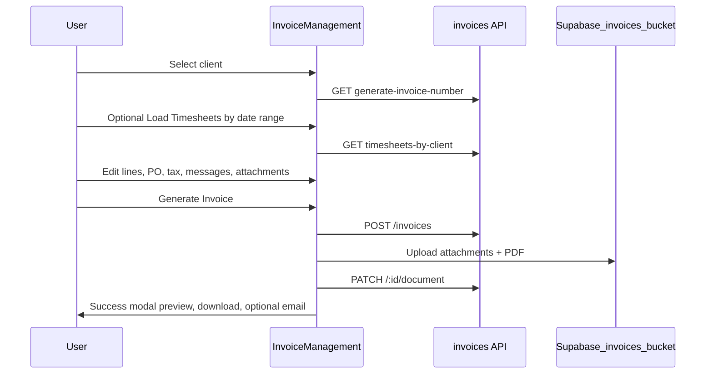

# Invoice Management — Functional & Technical Summary

**Scope:** Invoice CRUD UI, PDF generation, client email delivery, and invoice list. Excludes timesheet entry workflows (except how timesheets are read into invoices) and general reporting except where noted.

**Primary code locations:**
- Pages: [`client/src/pages/InvoiceManagement/InvoiceManagement.tsx`](../client/src/pages/InvoiceManagement/InvoiceManagement.tsx), [`client/src/pages/InvoiceManagement/InvoiceList.tsx`](../client/src/pages/InvoiceManagement/InvoiceList.tsx)
- API client: [`client/src/services/api/invoice.ts`](../client/src/services/api/invoice.ts)
- PDF: [`client/src/utils/pdfGenerator.tsx`](../client/src/utils/pdfGenerator.tsx)
- Attachments UI: [`client/src/components/InvoiceAttachments.tsx`](../client/src/components/InvoiceAttachments.tsx)
- Backend: [`server/src/routes/invoices.ts`](../server/src/routes/invoices.ts)
- Schema: [`server/src/db/migration_v2/007_invoices.sql`](../server/src/db/migration_v2/007_invoices.sql)
- Email templates: [`server/src/email-templates/invoice-html.ts`](../server/src/email-templates/invoice-html.ts)

---

## 1. Routes and navigation

### Frontend routes ([`client/src/App.tsx`](../client/src/App.tsx))

| Path | Component | Purpose |
|------|-----------|---------|
| `/invoice-management` | `InvoiceManagement` | Create invoice (same UI as `/create`) |
| `/invoice-management/create` | `InvoiceManagement` | Create invoice |
| `/invoice-management/create?id={uuid}` | `InvoiceManagement` | Edit existing invoice (`?id` query) |
| `/invoice-management/view/:id` | `InvoiceView` | Dedicated read-only invoice view & detail page |
| `/invoice-management/list` | `InvoiceList` | Paginated invoice list |

**Notes:** `/invoice-management/view/:id` provides a full read-only detail view including line items, attachments, tax summary, signed PDF preview link, and direct email trigger. `/invoice-management` and `/invoice-management/create` are duplicate routes mounting the create UI.

### Backend routes ([`server/src/index.ts`](../server/src/index.ts) mounts `/api/invoices`)

| Method | Path | Purpose |
|--------|------|---------|
| GET | `/api/invoices/generate-invoice-number` | Next invoice number |
| GET | `/api/invoices` | List + filters + pagination |
| GET | `/api/invoices/:id` | Single invoice |
| POST | `/api/invoices` | Create |
| PUT | `/api/invoices/:id` | Update |
| DELETE | `/api/invoices/:id` | Delete |
| PATCH | `/api/invoices/:id/document` | PDF metadata after client upload |
| GET | `/api/invoices/timesheets-by-client/:clientId` | Timesheets for line-item population |
| POST | `/api/invoices/:id/send-email` | Email invoice PDF to client |

**No server endpoint generates PDF bytes** — PDFs are built and uploaded in the browser.

---

## 2. Roles and access control

### Frontend guard

[`client/src/constants/accessControl.ts`](../client/src/constants/accessControl.ts):

```ts
INVOICE_MANAGEMENT_ROLES = ["admin", "accountant_manager"]
```

[`RoleRoute`](../client/src/components/ProtectedRoute.tsx) wraps all invoice routes; unauthorized users redirect to `/dashboard`. List actions (delete, send) have **no additional** per-button role checks.

### Backend `authorizeRoles` ([`server/src/middleware/auth.ts`](../server/src/middleware/auth.ts))

Passing `"recruiter"` expands to: `recruiter`, `bookkeeper`, `recruiter_manager`, `accountant_manager`, `sales`, `recruiter_director`.

| Endpoint | `authorizeRoles` | Extra rules |
|----------|------------------|-------------|
| GET generate-invoice-number | admin, recruiter | — |
| GET list / GET :id | admin, recruiter, jobseeker | Jobseeker: `created_by_user_id = self` |
| POST create | admin, recruiter, jobseeker | — |
| PUT update | admin, recruiter, jobseeker | Jobseeker: own rows, `status = 'draft'` only |
| DELETE | admin, recruiter | Comment says “Admin only” but handler does not enforce admin-only |
| PATCH document | admin, recruiter | — |
| GET timesheets-by-client | admin, recruiter | — |
| POST send-email | admin, recruiter | — |

### Role mismatches (important for marketing accuracy)

| Topic | Frontend | Backend |
|-------|----------|---------|
| Who can use invoice UI | `admin`, `accountant_manager` only | Broader API access |
| `bookkeeper`, `recruiter_manager`, `sales`, etc. | **No** invoice UI | Can call most invoice APIs if they have tokens |
| `jobseeker` | **No** invoice routes | Can create/read/update own drafts via API |
| Delete | Any invoice UI user sees delete button | `authorizeRoles(["admin", "recruiter"])` — not admin-only despite API client comment “Admin only” |
| Invoice Report | `REPORTS_ROLES` includes bookkeeper, recruiter_director | Reports API uses `admin`, `recruiter` expansion |

**Marketing-safe statement:** Day-to-day invoice creation, list, PDF, and email are intended for **Admin** and **Accountant Manager** in the product UI.

---

## 3. Invoice creation and editing

### User flow — create



### User flow — edit

1. List → pencil → `/invoice-management/create?id={id}`
2. `getInvoice(id)` loads record into form (`fetchInvoiceForEdit`)
3. Line items restored from `invoice_data.timesheets` (snapshot), not re-fetched from timesheet API
4. **Update Invoice** runs same pipeline as create: `PUT` → regenerate PDF → upload → `PATCH` document

### Form fields (all in `InvoiceManagement.tsx`)

| Area | State / control | Persistence |
|------|-----------------|-------------|
| Client | `CustomDropdown` → `selectedClient` | `client_id` + `invoice_data.client` |
| Payment terms | `PAYMENT_TERMS` dropdown (`Due on Receipt`, `Net 15` … `Net 90`) | `payment_terms` column + `invoice_data.paymentTerms` |
| Invoice date | date input (default: today, America/Toronto) | `invoice_date` |
| Due date | date input; auto from terms via `calculateDueDate` or manual | `due_date` |
| Invoice number | display; `generateInvoiceNumber()` on create | `invoice_number` |
| Timesheet range | start/end dates + **Load Timesheets** | Not stored as separate fields; optional `dateRange` in PDF only |
| Line items | see §4 | `invoice_data.timesheets` (JSONB snapshot) |
| Supplier / PO | rows: type (`Supplier No` / `PO No`) + number | `invoice_data.supplierPOItems` |
| Sales tax | per line: AB, BC, ON, QC, zero-rated, QC GST | per line `salesTax`; totals in columns |
| Message on invoice | textarea (default thank-you text) | `invoice_data.messageOnInvoice` |
| Terms on invoice | textarea (default interest text) | `invoice_data.termsOnInvoice` |
| Notes | textarea | `notes` column |
| Attachments | `InvoiceAttachments` | `invoice_data.attachments` + Supabase files |
| Summary | computed table (regular/OT, HST/GST/QST) | normalized columns: `subtotal`, `total_tax`, `total_hst`, `total_gst`, `total_qst`, `grand_total`, `total_hours` |
| Currency | from client | `currency` (CAD/USD) |

**Client panel** also displays company, short code, email, currency, and related contacts when loaded via `getClient`.

**Validation on submit:** client must have id, companyName, shortCode, emailAddress1; at least one line with hours > 0 and bill rate > 0; attachments must not be uploading or in error.

**Not exposed as line inputs:** `regularPayRate` / `premiumPayRate` are set from position/timesheet data on save but not separate editable fields in the grid (bill rate is editable).

### Timesheet → invoice flow (exact)

**UI trigger:** `fetchAndPopulateTimesheets()` after client + date range selected.

**API:** `GET /api/invoices/timesheets-by-client/:clientId?startDate=&endDate=`

**Backend query** ([`invoices.ts`](../server/src/routes/invoices.ts) ~1211–1254):
- `timesheets` joined to `positions` (client = `clientId`) and `jobseeker_profiles`
- Filter: `week_start_date >= startDate` AND `week_end_date <= endDate`
- Returns rates, hours, OT flags, position/jobseeker details, timesheet’s own `invoice_number` field (timesheet batch number — **not** linked to `invoices` table)

**UI mapping:**
- One line item **per timesheet row** (`key = timesheet.id`)
- Hours = regular + OT summed per row; description `Work period: {weekStart} - {weekEnd}`
- Default tax `13.00% [ON]`
- OT split via `calculateLineItemHours` using position `overtimeEnabled` / threshold
- **`setLineItems` replaces all existing lines** (no merge)

**On save:** line items serialized into `invoice_data.timesheets`. **No backend UPDATE to `timesheets` rows** — snapshot only.

### Manual line items

**Add:** `addLineItem()` — empty row, default ON tax.

**Editable:** position (fills bill/pay rates from position), jobseeker (global `getJobseekerProfiles` list — **not** filtered by position), description, hours (0.25 step), bill rate (`regularBillRate`), sales tax.

**Remove:** blocked if only one row remains.

**PDF:** regular and overtime rows split when OT hours > 0.

### Database writes — create/update

**Table:** `public.invoices` ([`007_invoices.sql`](../server/src/db/migration_v2/007_invoices.sql))

**On POST:** INSERT with normalized totals, `invoice_data` JSONB, `status` default `draft`, `version` 1, `version_history` entry `"created"`, `created_by_user_id` / `updated_by_user_id`.

**On PUT:** UPDATE fields + optional app-managed `version_history`; DB trigger `update_invoices_updated_at_column` also increments `version` on every UPDATE (possible double versioning).

**Side effects:**
- `activityLogger` → `recent_activities` (`create_invoice`, `update_invoice`, etc.)
- Trigger (inactivity monitor): may update `jobseeker_profiles.last_activity_at` for jobseekers in `invoice_data.timesheets`
- **Not updated:** timesheet records, invoice `status` → `sent` on email, storage files on delete

---

## 4. Invoice PDF and delivery

### PDF generation (client-side)

**Library:** `@react-pdf/renderer` in [`pdfGenerator.tsx`](../client/src/utils/pdfGenerator.tsx)

**Triggered:** end of `handleInvoiceSubmit` after API create/update.

**PDF includes:** logo, bill-to client, invoice # / dates / terms, line table (position, description, candidate, hours, rate, tax, amount), regular/OT split lines, subtotal, HST/GST/QST, grand total, message and terms text, work date range.

**Storage path:** Supabase bucket `invoices`, private, 50MB limit:

`{userId}/{invoiceNumber}/documents/Invoice_{number}_{company}.pdf`

**Metadata:** `PATCH /api/invoices/:id/document` sets `document_generated`, `document_path`, `document_file_name`, `document_file_size`, `document_mime_type`, `document_generated_at`.

### Attachments

[`InvoiceAttachments.tsx`](../client/src/components/InvoiceAttachments.tsx): max **10** files, **3MB** each; PDF, images, Excel/CSV, `.eml`.

Upload path: `{userId}/{invoiceNumber}/attachments/{uniqueFileName}` in bucket `invoices`.

On email send, uploaded attachments (`uploadStatus === "uploaded"`) are downloaded and attached to SendGrid message.

### Email sending

**Route:** `POST /api/invoices/:id/send-email` body `{ email }`

**Provider:** SendGrid (`SENDGRID_API_KEY`)

**Templates:** [`invoice-html.ts`](../server/src/email-templates/invoice-html.ts) — HTML + plain text with invoice #, dates, client name/email, amount due, optional `messageOnInvoice`; states PDF is attached.

**Subject:** `Invoice #{number} for {company_name}`

**From:** no-reply via `getNoReplyFromEmail()`

**To:** address from request (UI prefills `invoice_sent_to` or client `emailAddress1`)

**CC routing:**
1. `INVOICE_CC_EMAILS` env (comma-separated global CCs)
2. Per client flags on [`clients`](../server/src/types.ts) table (configured in Client Management):
   - `invoice_cc2` → `email_address2`
   - `invoice_cc3` → `email_address3`
   - `invoice_cc_dispatch` → `dispatch_dept_email`
   - `invoice_cc_accounts` → `accounts_dept_email`

**Attachments in email:** main invoice PDF + all uploaded invoice attachments.

### Delivery tracking

**Recorded on successful send:**
- `email_sent = true`
- `email_sent_date` (timestamptz)
- `invoice_sent_to` (recipient email)
- Activity log: `send_invoice_email` with metadata including CC list

**Not recorded:** SendGrid message ID, opens, bounces, delivery webhooks. **`status` stays `draft`** (or whatever it was) — not auto-set to `sent`.

**Send entry points:**
1. Success modal on form after generate/update ([`sendInvoiceToClient`](../client/src/pages/InvoiceManagement/InvoiceManagement.tsx))
2. List row Send/Resend button ([`InvoiceList.tsx`](../client/src/pages/InvoiceManagement/InvoiceList.tsx))

List send disabled when: no email, or `!documentGenerated`, or already sending. Resend uses same API; label toggles Send vs Resend when `emailSent`.

---

## 5. Invoice list and management

### Filters

**UI controls** ([`InvoiceList.tsx`](../client/src/pages/InvoiceManagement/InvoiceList.tsx)):

| Filter | API param | Backend support |
|--------|-----------|-----------------|
| Global search | `searchTerm` | invoice #, client name/short code/email |
| Invoice # column | `invoiceNumberFilter` | `ilike` on `invoice_number` |
| Client column | `clientFilter` | client name/short code |
| Client email column | `clientEmailFilter` | `email_address1` |
| Invoice date range | `dateRangeStart`, `dateRangeEnd` | `invoice_date` gte/lte |
| Invoice emailed | `invoiceSentFilter` | maps to `email_sent` |
| PDF generated | `documentGeneratedFilter` | `document_generated` |

**State exists but no list UI** (URL query hydration only): `dueDateStart`, `dueDateEnd`, `emailSentFilter`.

**Not wired to API:** `dueDateStart` / `dueDateEnd` are passed in list component state but [`getInvoices`](../client/src/services/api/invoice.ts) does **not** append them to the request; backend `applyInvoiceFilters` has no due-date filters.

**Duplicate filter:** `invoiceSentFilter` and `emailSentFilter` both target `email_sent` on backend; only `invoiceSentFilter` has a UI dropdown.

### List actions

| Action | Behavior |
|--------|----------|
| New invoice | Navigate to `/invoice-management/create` |
| Edit (pencil) | Same as view — full edit form |
| Delete | Confirmation modal → `DELETE /api/invoices/:id` → row removed locally; **no storage cleanup** |
| Send / Resend | `POST send-email` to `invoice_sent_to` or client primary email |

**Pagination:** page + limit 10/25/50/100, 300ms debounced fetch.

**Dashboard link:** metrics may deep-link to list with query params (documented in list comments).

### Invoice number generation

**For invoice records** (`invoices.invoice_number`):

- **UI:** `GET /api/invoices/generate-invoice-number` on new invoice (skipped in edit when client selected)
- **Format:** 6-digit zero-padded string, **no `INV-` prefix** (e.g. `000042`)
- **Logic:** lowest available integer gap-fill; accepts legacy `INV-######` when parsing existing numbers
- **DB fallback:** sequence `invoice_number_seq` + `generate_invoice_number()` if omitted on insert

**Separate system:** `GET /api/timesheets/generate-invoice-number` assigns numbers on **timesheet batches** — different table, **not coordinated** with invoice numbers.

---

## 6. Working vs partial vs stubbed

### Fully working (end-to-end in UI for admin / accountant_manager)

- Client selection with terms/currency defaults
- Load timesheets by client date range into line items
- Manual line items with tax and OT calculations
- Supplier/PO rows on invoice and PDF
- Create and edit with DB persistence
- Dedicated read-only invoice view page (`InvoiceView.tsx`) with PDF preview and status summary
- Client-side PDF generation and Supabase upload
- Document metadata PATCH
- Attachment upload and inclusion in email
- Send/resend email with CC rules and PDF + attachments
- Paginated list with core filters, delete, send
- Invoice number generation (gap-fill)
- Activity logging for create/update/delete/send
- Version history entry on create; updates append history in app code

### Partial / incomplete

- **Due date filters** — state/URL only, not sent to API or rendered in UI
- **`emailSentFilter`** — no UI; redundant with invoice emailed column
- **`invoiceSentFilter`** — labeled “invoice emailed” but backend comment says it maps to `email_sent` (no separate “invoice sent” field)
- **Status workflow** — `sent`/`paid`/`overdue` exist in schema but email does not set `status`; invoices remain `draft` unless manually set elsewhere
- **Timesheet linkage** — one-way snapshot; editing timesheets later does not update invoices; invoice create does not write timesheet `invoice_number`
- **Delete** — DB row only; PDF/attachment files may remain in storage
- **Jobseeker role** — API supports limited invoice CRUD but **no UI**
- **List email** — cannot change recipient from list (uses stored/client primary only); form modal allows editing email before send
- **Success modal close** — uses `window.location.reload()` (heavy UX)
- **Edit load errors** — `alert()` on failure

### Not implemented / stubbed

- Server-side PDF generation
- SendGrid delivery/bounce tracking
- Automatic `status = 'sent'` on email
- Storage cleanup on delete
- `apiRateLimiter` on invoice routes (commented out)
- Coordinating invoice numbers with timesheet batch numbers

---

## 7. Buyer-relevant automated behaviors

1. **Gap-fill invoice numbering** — reuses lowest free 6-digit number when invoices are deleted.
2. **Payment terms → due date** — selecting terms recalculates due date from invoice date.
3. **Timesheet load** — pulls approved timesheet rows for a client/week range into billable lines with rates and OT split from position rules.
4. **Provincial tax breakdown** — line tax selection drives HST/GST/QST totals on invoice, PDF, and stored columns.
5. **Overtime line splitting** — PDF and totals separate regular vs OT using position overtime settings and bill rates.
6. **Multi-contact CC** — client record flags + environment variable automatically CC accounts, dispatch, and secondary emails on send.
7. **Attachment bundling** — supporting files uploaded with the invoice are attached to the client email automatically.
8. **Full-text search** — generated `search_vector` on invoice #, client name, short code, message text.
9. **Dashboard metrics** — aggregate billed amounts, hours, email-sent counts (`/api/invoice-metrics`).
10. **Audit trail** — recent activities for create, update, delete, and email send.

---

## 8. `invoice_data` JSONB shape (typical)

Stored on every invoice; frontend is source of truth for detail:

- `client` — snapshot of client fields used on invoice
- `timesheets` — array of line snapshots (position, jobseeker, hours, rates, tax, description, bill/pay totals)
- `supplierPOItems` — supplier/PO rows
- `attachments` — metadata + `bucketName`, `filePath`, `uploadStatus`
- `messageOnInvoice`, `termsOnInvoice`, `paymentTerms`
- `document` — optional nested doc info (create helper sets `generated: false` initially)

Normalized columns duplicate key totals for reporting and constraints.
