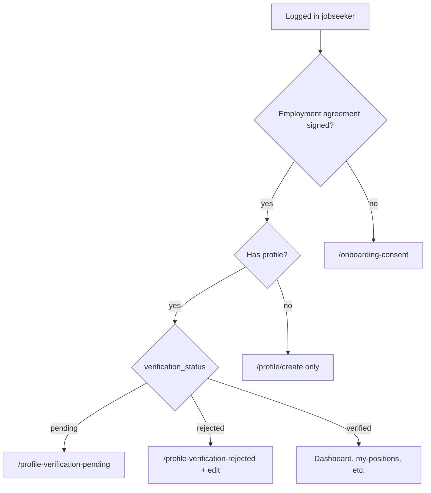

# Jobseeker & Client Management — Marketing Technical Report

This report reflects **what exists in the codebase today**, not roadmap items. Sources: [`client/src/constants/accessControl.ts`](../client/src/constants/accessControl.ts), [`client/src/App.tsx`](../client/src/App.tsx), [`server/src/routes/jobseekers.ts`](../server/src/routes/jobseekers.ts), [`server/src/routes/profile.ts`](../server/src/routes/profile.ts), [`server/src/routes/clients.ts`](../server/src/routes/clients.ts), [`docs/email-triggers-documentation.txt`](email-triggers-documentation.txt).

---

## Part 1 — Jobseeker Management

### 1.1 File inventory

**Pages & components**

| Purpose | Path |
|---------|------|
| List / search / delete entry | [`client/src/pages/JobseekerManagement/JobSeekerManagement.tsx`](../client/src/pages/JobseekerManagement/JobSeekerManagement.tsx) |
| Profile detail, verify/reject, AI display | [`client/src/pages/JobseekerManagement/JobSeekerProfile.tsx`](../client/src/pages/JobseekerManagement/JobSeekerProfile.tsx) |
| SIN & work permit focused list | [`client/src/pages/JobseekerManagement/SinWorkPermitManagement.tsx`](../client/src/pages/JobseekerManagement/SinWorkPermitManagement.tsx) |
| Self-service assigned positions | [`client/src/pages/JobseekerManagement/JobSeekerPositions.tsx`](../client/src/pages/JobseekerManagement/JobSeekerPositions.tsx) |
| Pending / rejected messaging | [`client/src/pages/JobseekerManagement/ProfileVerificationPending.tsx`](../client/src/pages/JobseekerManagement/ProfileVerificationPending.tsx), [`ProfileVerificationRejected.tsx`](../client/src/pages/JobseekerManagement/ProfileVerificationRejected.tsx) |
| Multi-step create/edit | [`client/src/pages/JobseekerProfile/ProfileCreate.tsx`](../client/src/pages/JobseekerProfile/ProfileCreate.tsx) |
| Edit wrapper | [`client/src/pages/JobseekerProfile/ProfileEdit.tsx`](../client/src/pages/JobseekerProfile/ProfileEdit.tsx) |
| Form steps | [`PersonalInfoForm.tsx`](../client/src/pages/JobseekerProfile/PersonalInfoForm.tsx), [`AddressQualificationsForm.tsx`](../client/src/pages/JobseekerProfile/AddressQualificationsForm.tsx), [`CompensationForm.tsx`](../client/src/pages/JobseekerProfile/CompensationForm.tsx), [`DocumentUploadForm.tsx`](../client/src/pages/JobseekerProfile/DocumentUploadForm.tsx) |
| Validation schemas | [`client/src/pages/JobseekerProfile/profileSchemas.ts`](../client/src/pages/JobseekerProfile/profileSchemas.ts) |
| Recruiter drafts | [`JobseekerDrafts.tsx`](../client/src/pages/JobseekerProfile/JobseekerDrafts.tsx), [`JobseekerProfileDraftEdit.tsx`](../client/src/pages/JobseekerProfile/JobseekerProfileDraftEdit.tsx) |
| Post-submit screens | [`ProfileAccountCreated.tsx`](../client/src/pages/JobseekerProfile/ProfileAccountCreated.tsx), [`ProfileSuccess.tsx`](../client/src/pages/JobseekerProfile/ProfileSuccess.tsx) |
| Jobseeker dashboard | [`client/src/pages/Dashboard/JobSeekerDashboard.tsx`](../client/src/pages/Dashboard/JobSeekerDashboard.tsx) |
| Onboarding consent gate | [`client/src/pages/Consent/OnboardingConsent.tsx`](../client/src/pages/Consent/OnboardingConsent.tsx) |
| Route gating | [`client/src/components/ProtectedRoute.tsx`](../client/src/components/ProtectedRoute.tsx) |
| Expiry dashboard widget | [`client/src/components/dashboard/ExpiryStatusOverview.tsx`](../client/src/components/dashboard/ExpiryStatusOverview.tsx) |
| Profile completion widget | [`client/src/components/dashboard/ProfileCompletion.tsx`](../client/src/components/dashboard/ProfileCompletion.tsx) |

**API clients**

- [`client/src/services/api/jobseeker.ts`](../client/src/services/api/jobseeker.ts)
- [`client/src/services/api/profile.ts`](../client/src/services/api/profile.ts)
- [`client/src/services/api/jobseekerMetrics.ts`](../client/src/services/api/jobseekerMetrics.ts)

**Backend**

| Mount | File |
|-------|------|
| `/api/jobseekers` | [`server/src/routes/jobseekers.ts`](../server/src/routes/jobseekers.ts) (global `authenticateToken`) |
| `/api/profile` | [`server/src/routes/profile.ts`](../server/src/routes/profile.ts) |
| `/api/metrics/jobseekers` | [`server/src/routes/jobseekerMetrics.ts`](../server/src/routes/jobseekerMetrics.ts) |
| Position assign emails | [`server/src/routes/positions.ts`](../server/src/routes/positions.ts) |
| Onboarding employment agreement | [`server/src/routes/consent.ts`](../server/src/routes/consent.ts) |

**Schema / migrations**

- [`server/src/db/migration_v2/002_jobseeker_profiles.sql`](../server/src/db/migration_v2/002_jobseeker_profiles.sql)
- [`server/src/db/migrations/20230826_update_jobseeker_profile_drafts.sql`](../server/src/db/migrations/20230826_update_jobseeker_profile_drafts.sql)
- Storage: `jobseeker-documents` bucket

---

### 1.2 Profile creation form — all fields

**Four steps:** Personal → Address & qualifications → Compensation → Documents.

**Step 1 — Personal** ([`profileSchemas.ts`](../client/src/pages/JobseekerProfile/profileSchemas.ts))

| Field | Required | Notes |
|-------|----------|--------|
| `firstName`, `lastName`, `dob`, `email`, `mobile` | Yes | |
| `billingEmail` | Optional | Used for timesheet/billing communications |
| `licenseNumber` **or** `passportNumber` | One required | Cross-field validation |
| `sinNumber` | Yes | If starts with `9` (temp resident): triggers work-permit rules |
| `sinExpiry` | If SIN starts with `9` | |
| `workPermitUci` | If SIN starts with `9` | 8 or 10 digits |
| `workPermitExpiry` | If SIN starts with `9` | |
| `businessNumber`, `corporationName` | Optional | Corp/subcontractor |
| `governmentIdType` | In Zod only | **Not in UI; not persisted** — ID proven via `government_id` document upload |

**Step 2 — Address & qualifications**

| Field | Required |
|-------|----------|
| `street`, `city`, `province`, `postalCode` | Yes |
| `workPreference` | Yes (min 10 chars) |
| `bio` | Yes (100–500 chars) |
| `licenseType`, `experience` | Yes |
| `manualDriving` | `NA` / `Yes` / `No` |
| `availability` | `Full-Time` / `Part-Time` |
| `weekendAvailability` | Boolean (default false) |

**Step 3 — Compensation**

| Field | Notes |
|-------|--------|
| `payrateType` | `Hourly` / `Daily` / `Monthly` (optional in schema) |
| `billRate`, `payRate`, `paymentMethod`, `hstGst`, `cashDeduction` | Optional |
| `sinPayrollHoursCap` | Required when payment method is **hybrid** |
| `overtimeEnabled`, `overtimeHours`, `overtimeBillRate`, `overtimePayRate` | Optional |

**Step 4 — Documents** (max 2MB; PDF/JPEG/PNG)

**Mandatory uploads:** `sin`, `government_id`; plus `work_permit` if SIN starts with `9`.

**Optional types:** `resume`, `drivers_license`, `passport`, `void_cheque`, `hst_registration`, `business_registration`, `forklift_license`, `other`.

Per document: type, title, file/path, filename, notes, optional `id` (UUID for AI linkage).

**Not on create form:** `employee_id` — assigned on **verify** (format `GS` + 6 digits).

---

### 1.3 Verification status workflow

| Status | Behavior | Who sets it |
|--------|----------|-------------|
| **pending** | Default on create; blocks jobseeker to pending page | System; also set when a **rejected** profile is updated (resubmit for review) |
| **verified** | Full portal access; auto-generates `employee_id` if missing | Staff via `PUT /api/jobseekers/profile/:id/status` — UI on [`JobSeekerProfile.tsx`](../client/src/pages/JobseekerManagement/JobSeekerProfile.tsx) |
| **rejected** | Jobseeker sees reason; can edit profile | Same endpoint; `rejectionReason` required |

**No email** on verify, reject, or return to pending.

**Activity log:** `verify_jobseeker`, `reject_jobseeker`, `pending_jobseeker` in `recent_activities`.

**Jobseeker routing** ([`ProtectedRoute.tsx`](../client/src/components/ProtectedRoute.tsx)):

---

### 1.4 Draft saving

| Mechanism | API | Storage |
|-----------|-----|---------|
| Jobseeker self-draft | `PUT/GET /api/profile/draft` | `jobseeker_profile_drafts` by `user_id` |
| Recruiter drafts | `POST/PUT/GET/DELETE /api/jobseekers/drafts*` | Same table |

- **Recruiter UI:** [`/jobseekers/drafts`](../client/src/pages/JobseekerProfile/JobseekerDrafts.tsx) — filters: search, email, creator, updater, dates.
- **Draft save skipped** in profile **edit** mode (existing published profile).
- Files uploaded to Supabase before draft save.

**Roles (UI):** `JOBSEEKER_DRAFT_ROLES` — admin, recruiter, recruiter_manager, recruiter_director (not bookkeeper).

**Backend gap:** `POST/PUT /api/jobseekers/drafts` use **`authenticateToken` only** (no recruiter role check).

---

### 1.5 AI document verification

**Trigger (async, fire-and-forget):** after `POST /api/profile/submit` and `PUT /api/jobseekers/profile/:id/update`.

**Outbound:** POST to `AI_VERIFICATION_URL` or default Heroku `.../analyze-profile-documents` with full profile payload + forwarded `Authorization` header.

**Inbound:** Response is logged only; external service expected to write **`ai_validation`** table.

**Read:** `GET /api/jobseekers/profile/:id` joins `ai_validation` per document: `document_authentication_percentage`, `is_tampered`, `is_blurry`, `is_text_clear`, `is_resubmission_required`, `notes`, `document_status`.

**UI:** [`JobSeekerProfile.tsx`](../client/src/pages/JobseekerManagement/JobSeekerProfile.tsx) per-document; list row flag in [`JobSeekerManagement.tsx`](../client/src/pages/JobseekerManagement/JobSeekerManagement.tsx); “in progress” when no row yet.

**Partial:** AI insights time-series in dashboard metrics commented out / TODO.

---

### 1.6 Document expiry tracking

**DB fields:** `sin_expiry`, `work_permit_expiry` (plus `sin_number`, `work_permit_uci`).

**Dashboard:** [`ExpiryStatusOverview.tsx`](../client/src/components/dashboard/ExpiryStatusOverview.tsx) → `GET /api/metrics/jobseekers/expiry-status-counts` — buckets: expired, ≤30/60/90 days, after 90, no data (SIN and work permit separately). Clicks through to SIN/work permit page.

**Dedicated page:** [`SinWorkPermitManagement.tsx`](../client/src/pages/JobseekerManagement/SinWorkPermitManagement.tsx) — full expiry status filters on list API.

**Main jobseeker list:** does **not** expose SIN/expiry column filters (API supports them).

**Profile detail:** visual expiry warnings (30/60/90 day thresholds) on SIN/work permit dates.

**Inactivity (display only):** `isInactive` when `last_activity_at` (or `created_at`) > **60 days** — badge on list and profile; not a filter.

---

### 1.7 Jobseeker self-service (after login)

| Capability | Route / mechanism | Gate |
|------------|-------------------|------|
| Sign employment agreement | `/onboarding-consent` | Before anything else |
| Create profile | `/profile/create` | No profile yet |
| Pending / rejected UX | `/profile-verification-pending`, `/profile-verification-rejected` | By status |
| Fix rejected profile | `/jobseekers/:id/edit` | Rejected only |
| Assigned positions | `/my-positions` | Verified |
| Dashboard | `/dashboard` + [`JobSeekerDashboard.tsx`](../client/src/pages/Dashboard/JobSeekerDashboard.tsx) | Verified |
| Profile completion widget | Dashboard | Verified; uses Supabase + API |
| Account settings | `/profile` | Authenticated |
| Training / metric examples | Allowed while pending/rejected | Utility routes in `ProtectedRoute` |
| “My Profile” menu → full profile page | Navigates to `/jobseekers/:id` | **Route guarded by `JOBSEEKER_LIST_ROLES` (excludes `jobseeker`)** — likely redirects to dashboard; API still returns data |

**Cannot (by design):** `/jobseeker-management`, recruiter drafts, verify others, delete profiles.

Nav items largely require `profileVerificationStatus === "verified"` in [`HamburgerMenu.tsx`](../client/src/components/HamburgerMenu.tsx).

---

### 1.8 Listing, search, filtering

**Page:** `/jobseeker-management` — roles: `JOBSEEKER_LIST_ROLES`.

**UI filters:** search, name, email, phone, location, employee ID, experience, verification status, updated date.

**API (`GET /api/jobseekers`):** above plus `sinNumberFilter`, `sinExpiryFilter`, `workPermitUciFilter`, `workPermitExpiryFilter`, `sinExpiryStatusFilter`, `workPermitExpiryStatusFilter` — used on SIN page, not main list.

**Pagination:** `page`, `limit` (default 25).

**TODO in API:** `creatorFilter`, `updaterFilter` not implemented.

---

### 1.9 Automated emails (jobseeker lifecycle)

| Event | Trigger | Template / service |
|-------|---------|-------------------|
| Welcome + optional attachments | `POST /api/profile/submit` | `jobseeker-welcome-html/txt`; attachments from storage `default-documents/jobseekerWelcomeDocs/` |
| Supabase email verification | New auth user on submit | Supabase Auth |
| Employment agreement | Submit + onboarding consent flow | `employment-agreement-html` — “Action Required: Sign Your Employment Agreement” |
| Assigned to position | `POST /api/positions/:id/assign` | `jobseeker-assignment-html/txt` |
| Removed from position | `DELETE .../assign/:candidateId` | `jobseeker-removal-html/txt` |
| Timesheet flows | `/api/timesheets*` | Uses `billing_email` or primary email |

**Not emailed:** verify, reject, pending, draft save.

---

### 1.10 Roles — frontend vs backend

**Frontend** uses **`hasAnyExactAccessRole`** (exact role match).

**Backend** `authorizeRoles(['recruiter'])` and `isAdminOrRecruiter` expand **`recruiter`** to: recruiter, bookkeeper, recruiter_manager, accountant_manager, sales, recruiter_director (+ admin).

| Area | Frontend roles | Backend | Mismatch? |
|------|----------------|---------|-----------|
| List `/jobseeker-management` | admin, recruiter, bookkeeper, recruiter_manager, accountant_manager, recruiter_director | `isAdminOrRecruiter` (+ **sales**) | **Sales:** API yes, UI no |
| Create `/profile/create` | + jobseeker | `authenticateToken` on submit | Aligned |
| Staff create success pages | admin, recruiter, recruiter_manager, recruiter_director | — | — |
| Drafts UI | admin, recruiter, recruiter_manager, recruiter_director | List: `isAdminOrRecruiter`; write: **token only** | **Any logged-in user could POST drafts** |
| SIN page | admin, recruiter, recruiter_manager, recruiter_director | Expiry metrics: `authorizeRoles(['admin','recruiter'])` includes bookkeeper | **Bookkeeper:** API yes, SIN UI no |
| Profile GET/PUT/status | `JOBSEEKER_LIST` for view page | **`authenticateToken` only** | **Any authenticated user with profile ID can read/update/status** |
| Delete | admin, recruiter_manager, recruiter_director | `authorizeExactRoles` same | Aligned |
| Jobseeker “My Profile” route | Menu: jobseeker only | Route: `JOBSEEKER_LIST` | **Jobseeker blocked from own profile page route** |

---

### 1.11 DB writes & side effects (jobseeker)

| Action | Writes | Side effects |
|--------|--------|--------------|
| Submit profile | `jobseeker_profiles` insert; may create `auth.users`; `hasProfile` metadata | Delete user draft row; welcome email; employment agreement consent + email; activity `create_jobseeker`; async AI POST |
| Update profile | `jobseeker_profiles` update | Rejected → **pending**; activity; async AI POST |
| Status change | `verification_status`, `rejection_reason`, optional `employee_id` | Activity log |
| Delete | Profile delete; `hasProfile: false` | Activity log |
| Draft | `jobseeker_profile_drafts` | — |
| Assign position | `position_candidate_assignments`, etc. | Email; activity |

Server uses **Supabase service role** on jobseeker routes (bypasses RLS).

---

### 1.12 Maturity — jobseeker

| Fully working | Partial / gap | Not wired |
|---------------|---------------|-----------|
| Multi-step create/edit + validation + doc upload | AI pipeline depends on external service writing `ai_validation` | `governmentIdType` end-to-end |
| Recruiter welcome email + attachments | Expiry filters only on SIN page, not main list | `ProfileRedirect.tsx` not in `App.tsx` |
| List, pagination, core filters | Creator/updater filters TODO | Monthly AI scan charts |
| Verify/reject + employee code | Jobseeker “My Profile” route vs menu | |
| Recruiter drafts | Profile API auth wider than UI | |
| Self-service positions, dashboard | Mixed draft APIs for self-serve jobseeker | |
| SIN/work permit page + expiry widget | `education` / `experienceList` empty placeholders on API | |
| Position assign/remove emails | 60-day inactive badge only (no workflow) | |
| AI display when data exists | | |

---

### 1.13 Key user flows (jobseeker)

**A. Recruiter creates jobseeker**

1. `JOBSEEKER_MANAGEMENT_CREATE_ROLES` → `/profile/create` (or draft first).
2. Four steps; optional Save Draft → `/api/jobseekers/drafts`.
3. Submit → `POST /api/profile/submit`.
4. DB profile + optional auth user + welcome email + employment agreement email + AI job queued.
5. Redirect to account-created / success pages (staff roles).

**B. Jobseeker self-registers**

1. Login → employment agreement (`/onboarding-consent`) if needed.
2. `/profile/create` until profile exists.
3. Submit → **pending** → `/profile-verification-pending`.
4. Staff verifies on `/jobseekers/:id` → **verified** → employee ID assigned.
5. Full dashboard and `/my-positions`.

**C. Rejected jobseeker**

1. `/profile-verification-rejected` with reason.
2. Edit at `/jobseekers/:id/edit` → update sets status back to **pending**.

**D. Staff verifies profile**

1. `/jobseeker-management` → open profile.
2. Status modal (admin/recruiter family in UI).
3. `PUT .../status` with `verified` or `rejected` (+ reason).

---

## Part 2 — Client Management

### 2.1 File inventory

| Purpose | Path |
|---------|------|
| List | [`client/src/pages/ClientManagement/ClientManagement.tsx`](../client/src/pages/ClientManagement/ClientManagement.tsx) |
| Create / edit / draft (shared form) | [`client/src/pages/ClientManagement/ClientCreate.tsx`](../client/src/pages/ClientManagement/ClientCreate.tsx) |
| Edit wrapper | [`ClientEdit.tsx`](../client/src/pages/ClientManagement/ClientEdit.tsx) |
| Draft edit wrapper | [`ClientDraftEdit.tsx`](../client/src/pages/ClientManagement/ClientDraftEdit.tsx) |
| Draft list | [`ClientDrafts.tsx`](../client/src/pages/ClientManagement/ClientDrafts.tsx) |
| Read-only view + consent | [`ClientView.tsx`](../client/src/pages/ClientManagement/ClientView.tsx) |
| API client | [`client/src/services/api/client.ts`](../client/src/services/api/client.ts) |
| Backend (monolithic route file) | [`server/src/routes/clients.ts`](../server/src/routes/clients.ts) → `/api/clients` |
| Schema | [`server/src/db/migration_v2/004_clients_and_positions.sql`](../server/src/db/migration_v2/004_clients_and_positions.sql), [`014_inactivity_monitor.sql`](../server/src/db/migration_v2/014_inactivity_monitor.sql) |
| Clients report | [`client/src/pages/Reports/ClientsReport.tsx`](../client/src/pages/Reports/ClientsReport.tsx) + `POST /api/reports/clients` |

**Routes** ([`App.tsx`](../client/src/App.tsx)): `/client-management`, `/view/:id`, `/create`, `/edit/:id`, `/drafts`, `/drafts/edit/:id`.

---

### 2.2 Client form — all fields

Implemented in [`ClientCreate.tsx`](../client/src/pages/ClientManagement/ClientCreate.tsx) (Zod `clientFormSchema`).

**Company**

| Field | Required | Notes |
|-------|----------|--------|
| `companyName` | Yes | Unique on server (409) |
| `billingName` | Yes | |
| `shortCode` | Zod 2–4 chars | |
| `listName` | Optional dropdown | `client_dropdown_options` |
| `website` | Optional | |
| `clientManager`, `salesPerson`, `accountingPerson`, `accountingManager`, `clientRep` | Optional dropdowns | |
| `mergeInvoice` | Checkbox | Default false |
| `currency` | CAD / USD | Default CAD |
| `workProvince` | Yes | Canadian provinces |
| `wsibCode` | Optional | Pattern `^[A-Z][0-9]$` |

**Contacts (3 fixed slots — not a separate table)**

| Slot | Fields | Invoice CC |
|------|--------|------------|
| Primary | name, email, mobile | Primary recipient |
| Secondary | name, email, mobile | `invoiceCC2` |
| Additional | name, email, mobile | `invoiceCC3` |
| Departments | `dispatchDeptEmail`, `accountsDeptEmail` | `invoiceCCDispatch`, `invoiceCCAccounts` |
| Language | `invoiceLanguage` | English / French |

**Addresses (3 fixed slots)**

Primary required: `streetAddress1`, `city1`, `province1`, `postalCode1`; secondary and additional optional (2 and 3).

**Payment & billing**

`preferredPaymentMethod`, `terms`, `payCycle`, `creditLimit`, `notes` — from [`client/src/constants/formOptions.ts`](../client/src/constants/formOptions.ts).

**No client status enum** on form — only computed inactivity badge.

---

### 2.3 Multiple contacts & addresses

- **Denormalized:** numbered columns on `clients` / `client_drafts`, not child tables.
- UI always shows three contact and three address sections.
- **Invoice CC flags** drive CC list when sending invoices ([`server/src/routes/invoices.ts`](../server/src/routes/invoices.ts)).
- **Consent** uses `email_address1` + `company_name` for `consentable_type = 'client'`.

---

### 2.4 Draft saving (clients)

| API | Behavior |
|-----|----------|
| `POST /api/clients/draft` | Create draft |
| `PUT /api/clients/draft/:id` | Partial update |
| `GET /api/clients/drafts` | Paginated list (all users’ drafts) |
| `GET /api/clients/draft/:id` | Owner-only (`created_by_user_id`) |
| `DELETE /api/clients/draft/:id` | Owner-only |

**UI:** Manual Save Draft; **auto-save every 60s** when dirty (not in client edit mode); exit confirmation if unsaved; publish → `POST /api/clients` then delete draft.

**No server validation on drafts** (full validation on publish).

**Broken/unused:** `GET /api/clients/draft` (latest for user) registered after `GET /:id` — path `draft` treated as ID; `getClientDraft()` in frontend has **no callers**.

**Partial:** draft list `creatorFilter` / `updaterFilter` applied in memory after pagination (wrong counts possible).

---

### 2.5 Status & inactivity

- **No** `status` / `active` column on `clients`.
- `last_activity_at` maintained by DB triggers on clients, positions, timesheets, invoices, assignments.
- **`isInactive`:** `last_activity_at` (or `created_at`) older than **30 days** — badge on list and [`ClientView.tsx`](../client/src/pages/ClientManagement/ClientView.tsx).
- No manual deactivate workflow or dedicated inactivity admin screen.

---

### 2.6 Consent history on client profile

- **Section:** “Digital Consent Records” on [`ClientView.tsx`](../client/src/pages/ClientManagement/ClientView.tsx).
- **API:** `GET /api/consent/entity-records/:id?consentableType=client` — cards with file name, version, status (`pending` / `completed` / `expired`), dates, link to consent dashboard.
- **Creating consent** is on Consent module (`CreateConsentPage`), not embedded on client profile.
- **Auth gap:** entity-records endpoint is **`authenticateToken` only** (no role guard matching client pages).

---

### 2.7 Roles — frontend vs backend (clients)

| Constant | Frontend (exact) |
|----------|------------------|
| `CLIENT_LIST/CREATE/DRAFT` | admin, recruiter_manager, accountant_manager, recruiter_director |
| `DELETE_CLIENT` | admin, recruiter_manager, recruiter_director |

| Operation | Backend |
|-----------|---------|
| List, get, create, update, drafts | `authorizeRoles(['admin', 'recruiter'])` → expands to **bookkeeper, sales**, etc. |
| Delete | `authorizeExactRoles` — matches delete constant |

| Role | Client UI | Client API (read/write) |
|------|-----------|---------------------------|
| admin, recruiter_manager, recruiter_director, accountant_manager | Yes | Yes |
| recruiter, bookkeeper, sales | **No** | **recruiter/bookkeeper: API yes**; **sales: API no** |

---

### 2.8 DB writes & side effects (clients)

| Action | Effects |
|--------|---------|
| Create / update | `clients` row; `create_client` / `update_client` activity; `sanitizeInputs`; cache invalidation |
| Delete | `delete_client` activity; **no cascade** in route — FKs may block |
| Drafts | `client_drafts`; low-priority activity |
| Related activity | Triggers refresh `clients.last_activity_at` |

**No emails** on client create/update/delete. Client data consumed by invoices (CC), consent emails, positions/timesheets pickers.

---

### 2.9 Maturity — client

| Fully working | Partial | Not wired |
|---------------|---------|-----------|
| List + filters + pagination + inactive badge | API wider than UI for recruiter/bookkeeper | `GET /api/clients/draft` latest-draft route |
| Create/edit + uniqueness + Zod | Inactivity display-only | |
| Draft lifecycle + auto-save + publish | Draft list shows all users’ drafts | |
| View all sections + consent list | Consent API weaker auth | |
| Dropdown-driven staff fields | Delete may fail on FKs | |
| WSIB field | Draft creator filters pagination bug | |
| Clients report | | |

---

### 2.10 Key user flows (client)

**Create:** `CLIENT_CREATE_ROLES` → `/client-management/create` → optional draft/auto-save → submit `POST /api/clients` → activity → list.

**Edit:** view or list → `/client-management/edit/:id` → `PUT /api/clients/:id`.

**Draft:** save → drafts list → edit → publish + delete draft.

**View + consent:** `/client-management/view/:id` → client data + paginated consent records.

**Delete:** admin / recruiter_manager / recruiter_director only → confirm → `DELETE`.

---

## Part 3 — Smart / automated behaviors (marketing highlights)

**Jobseeker**

- Auto welcome email + storage-backed welcome packet attachments on profile submit.
- Auto employment agreement consent record + email on submit (and onboarding consent endpoint if missing).
- Auto employee ID (`GS######`) on verification.
- Rejected profile update auto-returns to pending for re-review.
- Async AI document analysis on every submit/update (results when external service writes DB).
- Expiry dashboard buckets with drill-down to SIN/work permit management.
- Temp-resident rules: SIN starting with `9` cascades required work permit fields and document.
- Hybrid payment method requires SIN payroll hours cap.
- Position assignment/removal emails with position details and optional employee handbook attachment.
- 60-day inactivity badge on jobseeker records.

**Client**

- Company name uniqueness enforcement.
- 60s auto-save on client drafts.
- 30-day inactivity computed from cross-entity activity triggers.
- Invoice CC routing from contact/department checkboxes.
- Configurable dropdown options for managers, sales, accounting staff.
- Digital consent history on client profile view.

---

## Part 4 — Role reference (exact frontend lists)

From [`accessControl.ts`](../client/src/constants/accessControl.ts):

- **Jobseeker list:** admin, recruiter, bookkeeper, recruiter_manager, accountant_manager, recruiter_director
- **Jobseeker create:** above staff subset + **jobseeker**
- **Jobseeker drafts:** admin, recruiter, recruiter_manager, recruiter_director
- **Client pages:** admin, recruiter_manager, accountant_manager, recruiter_director
- **Delete jobseeker/client:** admin, recruiter_manager, recruiter_director

---

*Report generated from repository inspection (May 2026).*
