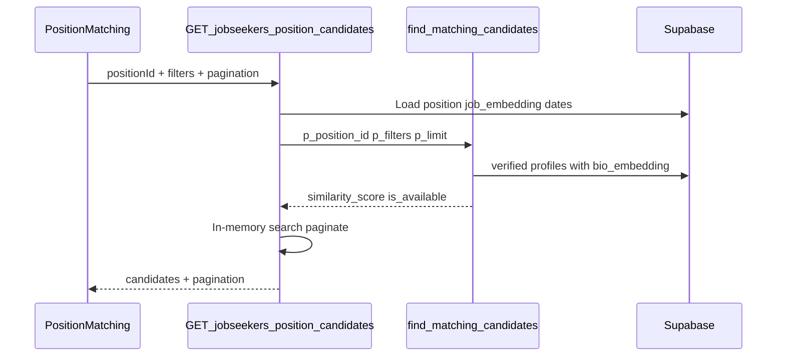

# Positions, Candidate Matching, and Calendar — Functional & Technical Report

This report reflects **what exists in the codebase today**, not roadmap items. Paths below are relative to the repo root.

**Terminology:** The product uses `is_subcategory` (“invoicing-only” / subcategory positions). There is no separate `invoice-only` column.

**Sources:** [`client/src/pages/PositionManagement/`](../client/src/pages/PositionManagement/), [`client/src/pages/Calendar/`](../client/src/pages/Calendar/), [`client/src/pages/JobseekerManagement/JobSeekerPositions.tsx`](../client/src/pages/JobseekerManagement/JobSeekerPositions.tsx), [`server/src/routes/positions.ts`](../server/src/routes/positions.ts), [`server/src/routes/positionDrafts.ts`](../server/src/routes/positionDrafts.ts), [`server/src/routes/calendar.ts`](../server/src/routes/calendar.ts), [`server/src/routes/jobseekers.ts`](../server/src/routes/jobseekers.ts), [`client/src/constants/accessControl.ts`](../client/src/constants/accessControl.ts), [`server/src/db/functions/find_matching_candidates.sql`](../server/src/db/functions/find_matching_candidates.sql).

---

## Executive summary

| Area | Maturity | Buyer-relevant highlights |
|------|----------|---------------------------|
| **Position management** | Production CRUD + drafts + subcategory invoicing rows | Auto position codes per client, rate/markup calculator, copy-from-position, column filters, draft workflow |
| **Matching & assignment** | Production with known gaps | Vector similarity (bio vs job embeddings), assign with email + activity log, capacity limits; availability filter weakened in SQL |
| **Calendar** | Production read-only view | Month/week/day/agenda grid + day side panel + summary widgets; client/jobseeker filters built but not wired on page |

---

## 1. Position management

### 1.1 File index

| Layer | Paths |
|-------|--------|
| **Routes (App)** | [`client/src/App.tsx`](../client/src/App.tsx) (~L201–218 positions; ~L151–153 calendar; ~L285 `/my-positions`) |
| **Pages** | [`PositionManagement.tsx`](../client/src/pages/PositionManagement/PositionManagement.tsx), [`PositionView.tsx`](../client/src/pages/PositionManagement/PositionView.tsx), [`PositionCreate.tsx`](../client/src/pages/PositionManagement/PositionCreate.tsx), [`PositionEdit.tsx`](../client/src/pages/PositionManagement/PositionEdit.tsx), [`PositionDrafts.tsx`](../client/src/pages/PositionManagement/PositionDrafts.tsx), [`PositionDraftEdit.tsx`](../client/src/pages/PositionManagement/PositionDraftEdit.tsx), [`PositionMatching.tsx`](../client/src/pages/PositionManagement/PositionMatching.tsx) |
| **Form sections** | [`client/src/pages/PositionManagement/components/`](../client/src/pages/PositionManagement/components/) — `BasicDetailsSection`, `AddressDetailsSection`, `EmploymentCategorizationSection`, `DocumentsRequiredSection`, `NormalPositionDetailsSection`, `SubcategoryPositionDetailsSection`, `OvertimeSection`, `NotesTasksSection`, `CopyFromPositionCard` |
| **Schema / utils** | [`positionCreateSchema.ts`](../client/src/pages/PositionManagement/positionCreateSchema.ts), [`positionCreateUtils.ts`](../client/src/pages/PositionManagement/positionCreateUtils.ts) |
| **Hooks** | [`usePositionClients.ts`](../client/src/pages/PositionManagement/hooks/usePositionClients.ts), [`usePositionCreateOptions.ts`](../client/src/pages/PositionManagement/hooks/usePositionCreateOptions.ts), [`usePositionRateCalculations.ts`](../client/src/pages/PositionManagement/hooks/usePositionRateCalculations.ts), [`useCopyFromPosition.ts`](../client/src/pages/PositionManagement/hooks/useCopyFromPosition.ts) |
| **API client** | [`client/src/services/api/position.ts`](../client/src/services/api/position.ts) |
| **Access constants** | [`client/src/constants/accessControl.ts`](../client/src/constants/accessControl.ts) |
| **Route guards** | [`client/src/components/ProtectedRoute.tsx`](../client/src/components/ProtectedRoute.tsx) (`RoleRoute`, `JobSeekerRoute`) |
| **Server routes** | [`server/src/routes/positions.ts`](../server/src/routes/positions.ts), [`server/src/routes/positionDrafts.ts`](../server/src/routes/positionDrafts.ts) |
| **Auth middleware** | [`server/src/middleware/auth.ts`](../server/src/middleware/auth.ts) (`authorizeRoles`, `authorizeExactRoles`, `RECRUITER_ACCESS_ROLES`) |
| **Subcategory helpers** | [`server/src/subcategoryPositionDetails.ts`](../server/src/subcategoryPositionDetails.ts) |
| **DB** | [`server/src/db/migration_v2/004_clients_and_positions.sql`](../server/src/db/migration_v2/004_clients_and_positions.sql), [`server/src/db/migrations/add_is_subcategory_to_positions.sql`](../server/src/db/migrations/add_is_subcategory_to_positions.sql), [`server/src/db/migrations/add_position_code_constraints.sql`](../server/src/db/migrations/add_position_code_constraints.sql) |
| **Styles** | [`PositionManagement.css`](../client/src/styles/pages/PositionManagement.css), [`PositionMatching.css`](../client/src/styles/pages/PositionMatching.css) |
| **Nav** | [`client/src/components/HamburgerMenu.tsx`](../client/src/components/HamburgerMenu.tsx) |

### 1.2 Backend API routes (positions)

Mounted in [`server/src/index.ts`](../server/src/index.ts): `/api/positions/draft` before `/api/positions`.

| Method | Path | Handler file | `authorizeRoles` / exact |
|--------|------|--------------|---------------------------|
| GET | `/api/positions` | `positions.ts` | `authorizeRoles(["admin", "recruiter"])` |
| GET | `/api/positions/client/:clientId` | `positions.ts` | same |
| GET | `/api/positions/:id` | `positions.ts` | same |
| GET | `/api/positions/generate-code/:clientId` | `positions.ts` | same |
| POST | `/api/positions` | `positions.ts` | same |
| PUT | `/api/positions/:id` | `positions.ts` | same |
| DELETE | `/api/positions/:id` | `positions.ts` | `authorizeExactRoles(["admin", "recruiter_manager", "recruiter_director"])` |
| POST | `/api/positions/:id/assign` | `positions.ts` | `authorizeExactRoles(["admin", "recruiter", "recruiter_manager", "recruiter_director"])` |
| DELETE | `/api/positions/:id/assign/:candidateId` | `positions.ts` | `authorizeExactRoles(["admin", "recruiter_manager", "recruiter_director"])` |
| GET | `/api/positions/:id/assignments` | `positions.ts` | `authorizeRoles(["admin", "recruiter"])` |
| GET | `/api/positions/candidate/:candidateId/assignments` | `positions.ts` | `authorizeRoles(["admin", "recruiter", "jobseeker"])` |
| GET/POST/PUT/GET/DELETE | `/api/positions/draft` (+ `/:id`) | `positionDrafts.ts` | `authorizeRoles(["admin", "recruiter"])` |

### 1.3 Routes, pages, and step-by-step flows

| URL | Page | Frontend guard | Step-by-step flow |
|-----|------|----------------|-------------------|
| `/position-management` | `PositionManagement` | `POSITION_LIST_ROLES` | Open list → apply column filters / search → paginate → **View** / **Edit** (if allowed) / **Delete** (managers+admin) |
| `/position-management/view/:id` | `PositionView` | `POSITION_LIST_ROLES` | Read-only detail → optional link to **Position Matching** with `?positionId=` |
| `/position-management/create` | `PositionCreate` | `POSITION_CREATE_ROLES` | Select **client** → auto **position code** → fill sections → **Publish** (full Zod validation) |
| `/position-management/create-subcategory` | `PositionCreate` (`defaultSubcategory`) | `POSITION_CREATE_ROLES` | Same form in subcategory mode → select multiple subcategory types → one DB row per type on publish |
| `/position-management/edit/:id` | `PositionEdit` → `PositionCreate` `isEditMode` | `POSITION_CREATE_ROLES` | Load position → edit → **PUT** `/api/positions/:id` |
| `/position-management/drafts` | `PositionDrafts` | `POSITION_DRAFT_ROLES` | List org drafts → filter → open draft |
| `/position-management/drafts/edit/:id` | `PositionDraftEdit` | `POSITION_DRAFT_ROLES` | Load draft (code regenerated) → edit → **Save draft** or **Publish** (publish deletes draft) |
| `/position-matching` | `PositionMatching` | `POSITION_MATCHING_ROLES` | See section 2 |

### 1.4 Position form fields (what exists)

**Source of truth:** [`positionCreateSchema.ts`](../client/src/pages/PositionManagement/positionCreateSchema.ts) + section components.

| Section | Fields |
|---------|--------|
| **Basic** | Client, title, `positionCode` (auto, disabled in UI), `positionNumber` (manual client ref), start/end dates, client manager, sales manager (from client, disabled), show on job portal (normal only), stat flag, description |
| **Subcategory mode** | `isSubcategoryForm`, multi-select `subcategoryPosition[]`, per-type `subcategoryPositionDetails[]` (payrate type, headcount, regular/premium pay, markup, bill rate) |
| **Address** | Street, city, province, postal code (prefill from client) |
| **Employment** | Employment term, employment type, position category, experience level |
| **Documents (normal only)** | 10 checkboxes: license, driver abstract, TDG, SIN, immigration status, passport, CVOR, resume, articles of incorporation, direct deposit — at least one required (schema `superRefine`) |
| **Pay (normal)** | Pay rate type, number of positions (headcount), regular pay rate, premium pay rate, markup %, bill rate (linked via calculator) |
| **Overtime** | Enabled flag; when on: overtime hours, overtime bill rate, overtime pay rate |
| **Payment** | `preferredPaymentMethod`, `terms` — schema defaults `"N/A"` on submit; **not shown on create/edit form**; displayed on [`PositionView`](../client/src/pages/PositionManagement/PositionView.tsx) |
| **Notes / tasks** | Notes (required), assigned to, project completion date, **task time** (free text) |

**Not in the codebase:** Dedicated shift start/end schedule fields (no `shift` references under `PositionManagement/`). Scheduling-related inputs are **position start/end dates**, **task time**, and **project completion date** — not shift slots.

**Dropdowns:** Static options in [`client/src/constants/formOptions.ts`](../client/src/constants/formOptions.ts); position titles and subcategory labels from `dropdown_options` API (`position_title`, `subcategory_position`).

**Smart / automated behaviors:**

- [`usePositionRateCalculations.ts`](../client/src/pages/PositionManagement/hooks/usePositionRateCalculations.ts) — syncs markup ↔ bill rate from pay rate; mirrored per subcategory row.
- **Copy from position** ([`CopyFromPositionCard`](../client/src/pages/PositionManagement/components/CopyFromPositionCard.tsx), [`useCopyFromPosition.ts`](../client/src/pages/PositionManagement/hooks/useCopyFromPosition.ts)) — copies fields and regenerates position code for target client.
- **Client address prefill** when client is selected.
- **Subcategory:** `showOnJobPortal` forced `false`; documents section hidden.

### 1.5 Auto-generated position codes

| Piece | Behavior |
|-------|----------|
| **Format** | `{CLIENT_SHORT_CODE}{3-digit-seq}` e.g. `ABC001` |
| **SQL** | `generate_next_position_code` in [`004_clients_and_positions.sql`](../server/src/db/migration_v2/004_clients_and_positions.sql) / [`add_position_code_constraints.sql`](../server/src/db/migrations/add_position_code_constraints.sql) — max numeric suffix from **both** `positions` and `position_drafts` matching `^{short_code}[0-9]{3}$`, then zero-pad |
| **API** | `GET /api/positions/generate-code/:clientId` |
| **UI triggers** | Client select on create; opening a draft (regenerates); copy-from-position |
| **Failure** | HTTP 400 if client has no `short_code` |
| **Manual field** | `positionNumber` is separate, user-entered, not auto-generated |

### 1.6 Draft saving

| Aspect | Behavior |
|--------|----------|
| **Who (UI)** | `POSITION_DRAFT_ROLES` = admin, recruiter_manager, recruiter_director |
| **Who (API)** | `authorizeRoles(["admin", "recruiter"])` — expands to all `RECRUITER_ACCESS_ROLES` (includes plain `recruiter`, bookkeeper, sales, etc.) |
| **Manual save** | “Save draft” — requires **client** + valid start/end date order only (not full Zod) |
| **Auto-save** | `setInterval` **60 seconds** when `hasUnsavedChanges && !isEditMode` in [`PositionCreate.tsx`](../client/src/pages/PositionManagement/PositionCreate.tsx) (L433–443) — runs during create and draft-edit, not published-position edit |
| **Publish** | `createPosition` then `deletePositionDraft` when publishing from draft |
| **Storage** | `position_drafts` table |
| **API** | `POST /api/positions/draft`, `PUT /api/positions/draft/:id`, `GET` list/single, `DELETE` |
| **Activity log** | `create_position_draft`, `update_position_draft`, `delete_position_draft` |
| **Emails** | None on draft save |

**Draft list filters (UI → API):** search, title, client, position ID (`position_code`), position code column (`position_number` via `positionCodeFilter`), creator, updater, updated date, created date, start date. Creator/updater are **sent to the API** from [`PositionDrafts.tsx`](../client/src/pages/PositionManagement/PositionDrafts.tsx) but applied **in-memory after pagination** on the server ([`positionDrafts.ts`](../server/src/routes/positionDrafts.ts) ~L378–398) — total counts can be wrong when those filters are used.

**Draft gaps (honest):**

- List endpoint returns **org-wide** drafts, not scoped to `created_by_user_id`.
- `PUT` draft does **not** verify `created_by_user_id` (GET/DELETE by id do).
- Plain **recruiter** cannot open draft UI but **can call draft APIs** if they know URLs.

### 1.7 Subcategory / “invoice-only” positions

Per [`add_is_subcategory_to_positions.sql`](../server/src/db/migrations/add_is_subcategory_to_positions.sql): *“invoicing-only … excluded from position matching, jobseeker assignment, calendar events.”*

| Behavior | Detail |
|----------|--------|
| **Creation** | One DB row per selected subcategory type; shared `subcategory_group_id`; first row `is_primary_subcategory` (shown in lists); title `{baseTitle} - {subcategoryType}` |
| **UI entry** | `/position-management/create-subcategory` only — no “mark as subcategory” toggle on normal create |
| **Restrictions** | `POST .../assign` → 400; excluded from matching UI (`!isSubcategory`); calendar query `is_subcategory = false`; `showOnJobPortal` forced false; documents not required (server + form) |
| **Bulk timesheet** | Banner when position is subcategory — directs to single timesheet flow |

### 1.8 Listing and filters

**Page:** [`PositionManagement.tsx`](../client/src/pages/PositionManagement/PositionManagement.tsx) → `GET /api/positions` → `applyPositionFilters` in [`positions.ts`](../server/src/routes/positions.ts).

| Filter | Query param | Server field |
|--------|-------------|--------------|
| Global search | `search` | code, number, title, city, province, employment fields, category, experience, client name |
| Position ID | `positionIdFilter` | `position_code` |
| Position number | `positionNumberFilter` | `position_number` |
| Title | `titleFilter` | `title` |
| Client | `clientFilter` | `client_name` |
| Location | `locationFilter` | city OR province |
| Employment term/type | `employmentTermFilter`, `employmentTypeFilter` | exact match |
| Category / experience | `positionCategoryFilter`, `experienceFilter` | exact match |
| Show on portal | `showOnPortalFilter` | boolean |
| Date | `dateFilter` | `start_date` on that day |
| Subcategory (API only) | `isSubcategoryFilter` | **not wired in list UI** |
| All siblings (API only) | `showAllSiblings` | **not wired in list UI** |

**Default list behavior:** Hides non-primary subcategory siblings (`is_subcategory=false OR is_primary_subcategory=true`). Badges distinguish normal vs subcategory.

### 1.9 Roles — position management

Frontend uses **exact** role match (`hasAnyExactAccessRole` in [`client/src/lib/auth.ts`](../client/src/lib/auth.ts)). Backend `authorizeRoles(["admin","recruiter"])` **expands** `recruiter` to: recruiter, bookkeeper, recruiter_manager, accountant_manager, sales, recruiter_director ([`auth.ts`](../server/src/middleware/auth.ts) `RECRUITER_ACCESS_ROLES`).

| Action | Frontend (`accessControl.ts`) | Backend |
|--------|------------------------------|---------|
| List / view | `POSITION_LIST_ROLES`: admin, recruiter, bookkeeper, recruiter_manager, accountant_manager, recruiter_director | `authorizeRoles` admin + expanded recruiter |
| Create / edit / drafts UI | `POSITION_CREATE_ROLES` / `POSITION_DRAFT_ROLES`: admin, recruiter_manager, recruiter_director | `authorizeRoles` admin + expanded recruiter |
| Delete position | `DELETE_POSITION_ROLES` (UI): admin, recruiter_manager, recruiter_director | `authorizeExactRoles` — **aligned** |
| Draft API | Draft roles on UI only | `authorizeRoles` — **broader than UI** |

**Mismatches for marketing accuracy:**

- Plain **`recruiter`**: list/view + matching yes; create/edit/draft UI **no**; create/draft API **yes** if called directly.
- **`bookkeeper`**: position list UI **yes**; create UI **no**; matching UI **no**; many position APIs **yes** via expanded recruiter.
- **`sales`**: no position menu items; calendar only among these three areas; APIs may still respond if called with token.
- **`accountant_manager`**: in position **list** UI; not in create/matching UI.

### 1.10 DB writes and side effects

| Operation | Tables / effects |
|-----------|------------------|
| **Create normal** | `positions` insert; activity `create_position`; job embedding queued if DB `util.queue_embeddings()` exists |
| **Create subcategory** | Multiple `positions` rows + `subcategory_group_id` |
| **Update** | `positions` update; activity `update_position` |
| **Delete** | Deletes subcategory group; activity `delete_position` |
| **Draft** | `position_drafts` only until publish |
| **Emails** | **None** on position CRUD |

### 1.11 Working vs partial

| Fully working | Partial / gap |
|---------------|----------------|
| CRUD, view, list filters, auto codes, drafts (manual + 60s auto-save), subcategory invoicing rows, copy-from, rate calculator | No shift scheduling fields; `isSubcategoryFilter` not in list UI; draft list not per-user; draft PUT ownership; creator/updater filter pagination; payment fields N/A on create form; role UI stricter than API for create/drafts |

---

## 2. Candidate matching and assignment

### 2.1 File index

| Layer | Paths |
|-------|--------|
| **Matching UI** | [`PositionMatching.tsx`](../client/src/pages/PositionManagement/PositionMatching.tsx) |
| **Jobseeker portal** | [`JobSeekerPositions.tsx`](../client/src/pages/JobseekerManagement/JobSeekerPositions.tsx) (`/my-positions`) |
| **Recruiter profile assignments** | [`JobSeekerProfile.tsx`](../client/src/pages/JobseekerManagement/JobSeekerProfile.tsx) |
| **Position detail** | [`PositionView.tsx`](../client/src/pages/PositionManagement/PositionView.tsx) |
| **API client** | [`position.ts`](../client/src/services/api/position.ts) — `getPositionCandidates`, `assignCandidateToPosition`, `removeCandidateFromPosition`, `getPositionAssignments`, `getCandidateAssignments` |
| **Matching API** | [`jobseekers.ts`](../server/src/routes/jobseekers.ts) — `GET /position-candidates/:positionId` (`isAdminOrRecruiter`) |
| **Assignment API** | [`positions.ts`](../server/src/routes/positions.ts) — assign, remove, assignments |
| **RPC** | [`find_matching_candidates.sql`](../server/src/db/functions/find_matching_candidates.sql) |
| **Embeddings** | [`011_embeddings.sql`](../server/src/db/migration_v2/011_embeddings.sql) |
| **Emails** | [`jobseeker-assignment-html.ts`](../server/src/email-templates/jobseeker-assignment-html.ts), [`jobseeker-assignment-txt.ts`](../server/src/email-templates/jobseeker-assignment-txt.ts), [`jobseeker-removal-html.ts`](../server/src/email-templates/jobseeker-removal-html.ts), [`jobseeker-removal-txt.ts`](../server/src/email-templates/jobseeker-removal-txt.ts); [`emailNotifier.ts`](../server/src/middleware/emailNotifier.ts) |
| **Activity** | [`activityLogger.ts`](../server/src/middleware/activityLogger.ts) |

### 2.2 How matching works

| Aspect | Detail |
|--------|--------|
| **Trigger** | User selects **client** → **position** on `/position-matching`; deep link `?clientId=&positionId=`; or from position view → matching with `?positionId=` |
| **Exclusions** | Subcategory positions filtered client-side (`!isSubcategory`) |
| **Algorithm** | Cosine similarity: `1 - (bio_embedding <=> job_embedding)`; requires **both** embeddings non-null |
| **Candidate pool** | `jobseeker_profiles` where `verification_status = 'verified'` and `bio_embedding IS NOT NULL` |
| **RPC filters (JSONB)** | experience, availability, weekend_availability, city, province, `only_available` |
| **UI filters** | Search (≥3 chars server-side), experience, availability, weekend; `onlyAvailable=true` hardcoded |
| **UI display** | Similarity % with color bands; Lottie “AI” loading — **cosmetic only**, no separate ML service |
| **Post-RPC** | Handler requests very large `p_limit`, then filters/paginates **in Node**; `sortBy` / `sortOrder` query params **not applied** |

**Known gap (marketing accuracy):** Live RPC sets `TRUE AS is_available` for every row ([`find_matching_candidates.sql`](../server/src/db/functions/find_matching_candidates.sql) L42). A `LEFT JOIN` on overlapping `position_candidate_assignments` exists in the CTE but is unused for availability. **`only_available` filter does not exclude busy candidates.** Legacy [`find_matching_candidates_old.sql`](../server/src/db/functions/find_matching_candidates_old.sql) computed availability from assignments.

### 2.3 Assign flow (recruiter) — step by step

| Step | What happens |
|------|----------------|
| 1 | Navigate to `/position-matching` (menu: Position Matching) |
| 2 | Select **client** (`getClients`) → **position** (`getClientPositions`; subcategories excluded) |
| 3 | `getPositionAssignments` → assigned panel + vacant slots vs `numberOfPositions` |
| 4 | `getPositionCandidates` → ranked candidate list |
| 5 | Click **Assign** on candidate → confirmation modal (mentions email) |
| 6 | Client blocks if `assignedCount >= numberOfPositions` |
| 7 | `POST /api/positions/:id/assign` body: `{ candidateId, startDate, endDate }` — dates from position record; `candidateId` = jobseeker auth `user_id` |
| 8 | Server: reject if `is_subcategory`; verify profile; no duplicate `status = 'active'` pair; capacity &lt; `number_of_positions` |
| 9 | **Insert** `position_candidate_assignments` (`status: "active"`, audit user ids) |
| 10 | **Update** `positions.assigned_jobseekers` array (append UUID) |
| 11 | **Activity** `assign_jobseeker` / category `position_management` |
| 12 | **Email** SendGrid to jobseeker (assignment templates; requires env + `ASSIGNMENT_FROM_EMAIL`) |
| 13 | DB triggers update `last_activity_at` on client/jobseeker ([`014_inactivity_monitor.sql`](../server/src/db/migration_v2/014_inactivity_monitor.sql)) |
| 14 | UI refreshes assignments; status toast |

**Assign roles:** Frontend `POSITION_MATCHING_ROLES` + backend `authorizeExactRoles`: admin, recruiter, recruiter_manager, recruiter_director.

### 2.4 Remove flow — step by step

| Step | What happens |
|------|----------------|
| 1 | **Remove** visible only for `REMOVE_ASSIGNED_JOBSEEKER_ROLES`: admin, recruiter_manager, recruiter_director |
| 2 | Plain **recruiter** can assign but remove control is hidden/disabled |
| 3 | Confirm modal → `DELETE /api/positions/:id/assign/:candidateId` |
| 4 | **Hard delete** assignment row (not status flip to cancelled) |
| 5 | Remove UUID from `positions.assigned_jobseekers` |
| 6 | **Activity** `remove_jobseeker` |
| 7 | **Email** removal templates to jobseeker |

**Mismatch:** Plain recruiter **cannot** remove (UI and API aligned). They **can** assign.

### 2.5 Assignment tracking

| View | Route / API | Shows |
|------|-------------|-------|
| **By position** | `GET /api/positions/:id/assignments` | Rows + `jobseekerProfile` (incl. `is_inactive` from 60-day rule); used in matching, `PositionView`, timesheets |
| **By jobseeker (staff)** | `GET /api/positions/candidate/:candidateId/assignments` | Paginated; filters: status, dates, search, employment type, category; `statusCounts`; compensation block omitted for jobseeker role |
| **List denorm** | `GET /api/positions` | `syncAssignedJobseekers()` — `assigned_jobseekers` reflects **active** assignment rows only |
| **Calendar** | `GET /api/calendar` | Reads assignments for assigned events (section 3) |

**Status values:** `active`, `upcoming`, `completed`, `cancelled` in types/UI. Assign route **only writes `active`**. No application code found that transitions assignments to `upcoming` / `completed` — `/my-positions` tabs may be empty except **Current** unless statuses are set outside this app.

### 2.6 `/my-positions` (jobseekers)

| Item | Detail |
|------|--------|
| **Route** | `/my-positions` → [`JobSeekerPositions.tsx`](../client/src/pages/JobseekerManagement/JobSeekerPositions.tsx) |
| **Gate** | `JobSeekerRoute` in [`App.tsx`](../client/src/App.tsx); menu hidden until profile **verified** |
| **Data** | `user.id` as `candidateId` → `getCandidateAssignments` |
| **Tabs** | All / Current (`active`) / Upcoming (`upcoming`) / Completed (`completed`); `?status=current|past|future|all` deep links from dashboard metrics |
| **Filters** | Search, employment type, position category (server-side) |
| **Cards** | Title, position code, client, city/province, position dates, assignment duration, employment type/term, category, experience, status badge |
| **Pagination** | 10 per page |
| **Pay** | Not displayed on cards; API strips compensation for jobseeker role |

**Security gap:** `GET /api/positions/candidate/:candidateId/assignments` allows `jobseeker` role but does **not** enforce `candidateId === req.user.id`. Do not claim strict self-only API enforcement in marketing without a fix.

### 2.7 Roles — matching & assignment

| Endpoint | Backend | Frontend |
|----------|---------|----------|
| `GET .../position-candidates/:id` | `isAdminOrRecruiter` (bookkeeper, sales, etc.) | `/position-matching`: admin, recruiter, recruiter_manager, recruiter_director only |
| `POST .../assign` | Exact: admin, recruiter, recruiter_manager, recruiter_director | Same |
| `DELETE .../assign` | Exact: admin, recruiter_manager, recruiter_director | Remove button same |
| `GET .../assignments` (position) | Expanded recruiter | Staff with position list access |
| `GET .../candidate/.../assignments` | admin, expanded recruiter, jobseeker | `/my-positions` for jobseekers |

### 2.8 DB and side effects summary

| Table / system | Role |
|----------------|------|
| `position_candidate_assignments` | Source of truth for assignments |
| `positions.assigned_jobseekers` | Denormalized UUID array (synced on assign/remove/list) |
| `positions.job_embedding` | Matching input |
| `jobseeker_profiles.bio_embedding` | Matching input |
| `recent_activities` | assign / remove audit |
| `timesheets.assignment_id` | FK to assignments (downstream payroll) |
| SendGrid | Assignment + removal emails (env-dependent) |

### 2.9 Working vs partial

| Fully working | Partial — do not overclaim |
|---------------|----------------------------|
| Vector ranking UI, assign with capacity check, emails + activity log, assignment lists, `/my-positions` UI | Reliable “available only” filtering; sort params; bookkeeper/sales matching UI; plain recruiter remove; automatic status lifecycle; empty match list without embeddings; employee handbook on assign (not in assign route) |

### 2.10 Buyer-facing automation (accurate)

- **Semantic matching** from stored embeddings (not keyword search).
- **Capacity enforcement** at assign (client + server).
- **Assignment / removal emails** with position context.
- **Activity feed** entries for ops visibility.
- **Inactive jobseeker** flag on assignment lists (60-day activity rule).

---

## 3. Calendar

### 3.1 File index

| Layer | Paths |
|-------|--------|
| **Page** | [`CalendarPage.tsx`](../client/src/pages/Calendar/CalendarPage.tsx), [`CalendarPage.css`](../client/src/pages/Calendar/CalendarPage.css) |
| **Components** | [`CalendarView.tsx`](../client/src/components/calendar/CalendarView.tsx), [`DayViewPanel.tsx`](../client/src/components/calendar/DayViewPanel.tsx), [`SummaryWidgets.tsx`](../client/src/components/calendar/SummaryWidgets.tsx), [`CalendarFilters.tsx`](../client/src/components/calendar/CalendarFilters.tsx) (**built, not mounted**) |
| **API client** | [`calendar.ts`](../client/src/services/api/calendar.ts) |
| **API routes** | [`calendar.ts`](../server/src/routes/calendar.ts) |
| **App route** | [`App.tsx`](../client/src/App.tsx) — `/calendar`, `CALENDAR_ROLES` |
| **i18n** | [`en.json`](../client/src/contexts/language/locales/en.json), [`fr.json`](../client/src/contexts/language/locales/fr.json) (`calendar` keys) |
| **Reference (not routed)** | [`renderedcalenderhtml.html`](../client/src/components/calendar/renderedcalenderhtml.html) |

No dedicated `useCalendar*` hooks — state lives in page/components.

### 3.2 Backend API routes (calendar)

| Method | Path | Middleware |
|--------|------|------------|
| GET | `/api/calendar` | `authenticateToken`, `authorizeRoles(['admin','recruiter'])`, `sanitizeInputs` |
| GET | `/api/calendar/summary` | same (`apiRateLimiter` commented out on both) |

### 3.3 What the calendar displays

**Read-only** workforce schedule — no create/edit events in UI.

| Event type | Source | Display |
|------------|--------|---------|
| **Assigned** | `position_candidate_assignments` overlapping query range | Title: `{jobseekerName} - {position.title}`; blue gradient |
| **Open capacity** | Positions with `availablePositions > 0` (only when `jobseekerId` filter absent) | Title: `{title} ({n} available)`; orange gradient |

**Supabase tables:** `positions` (non-draft, non-subcategory, date overlap), `position_candidate_assignments`, `jobseeker_profiles` (names).

**Excludes:** `is_draft`, `is_subcategory`.

**Event fields:** `id`, `title`, `start`, `end`, `jobseekerId`, `jobseekerName`, `positionId`, `positionTitle`, `clientId`, `clientName`, `totalPositions`, `assignedCount`, `availablePositions`, `allDay: true`.

**Note:** Assignment `status` is used for summary `statusBreakdown` but **not** to hide cancelled rows on the main grid.

**Frontend:** [`CalendarPage`](../client/src/pages/Calendar/CalendarPage.tsx) uses `response.events` only — `summary` on the main calendar response is **ignored**. [`SummaryWidgets`](../client/src/components/calendar/SummaryWidgets.tsx) calls `GET /api/calendar/summary` separately.

### 3.4 Month view vs day view (two concepts)

| UI part | Technology | Behavior |
|---------|------------|----------|
| **Main grid** | `react-big-calendar` | Default **month**; toolbar: month, week, day, agenda |
| **Month navigation** | `onNavigate` → `viewedDate` | Refetch `GET /api/calendar` for that calendar month |
| **Week/day/agenda** | Same `events` array | Layout only; does not change API range or side-panel fetch |
| **Day side panel** | `DayViewPanel` | Filters **already-loaded month** events to `selectedDate`; **no refetch** on day change |
| **Select day** | `onSelectSlot` | Sets `selectedDate` (defaults to **today** on load) |
| **Select event** | `onSelectEvent` | **`console.log` only** ([`CalendarPage.tsx`](../client/src/pages/Calendar/CalendarPage.tsx) L75–78) — no modal or navigation |

### 3.5 Side panel contents

When `selectedDate` is set:

- Header: “Day View” + formatted weekday/date
- Count: events or “no events”
- **Event cards:** type (assigned vs open), all-day duration, position title, jobseeker name (if assigned), client name
- **View Details** → `/position-management/view/{positionId}`
- **Day summary** (if events): total events, unique positions, total capacity, assigned jobseekers, available positions (deduped by `positionId`)
- Empty states: no date selected; or no events on date
- Loading skeleton when parent `loading=true`

### 3.6 Filters — in code vs active

| Filter | In code | Active on page |
|--------|---------|----------------|
| **Client dropdown** | [`CalendarFilters.tsx`](../client/src/components/calendar/CalendarFilters.tsx) + API `clientId` | **No** — import/JSX commented out on `CalendarPage` (L6, L26–43, L120–133) |
| **Jobseeker dropdown** | Same + API `jobseekerId`; suppresses open-position events when set | **No** |
| **Date range (filter bar)** | `CalendarFilters` + quick-range buttons (commented inside component) | **No** |
| **Month fetch range** | `CalendarPage` uses viewed month start/end | **Yes** (implicit via grid navigation) |
| **Summary period** | `SummaryWidgets`: Today / This week / This month / custom + Apply | **Yes** |
| **Summary client/jobseeker** | Props supported on `SummaryWidgets` | **No** — `<SummaryWidgets />` with no props |

Helper exports in [`calendar.ts`](../client/src/services/api/calendar.ts) (`getUniqueClientsFromEvents`, etc.) are **unused** while filters are commented out.

**Grid vs summary:** Changing calendar month does **not** update summary widgets (widgets default to current period).

### 3.7 Roles

| Layer | Roles |
|-------|-------|
| **Frontend** | `CALENDAR_ROLES` = all `INTERNAL_STAFF_ROLES`: admin, recruiter, bookkeeper, recruiter_manager, accountant_manager, sales, recruiter_director |
| **Backend** | `authorizeRoles(['admin','recruiter'])` with recruiter expansion — effectively same internal staff set |
| **Jobseeker** | **Blocked** on `/calendar` and API |

### 3.8 DB / side effects

Calendar routes are **read-only** — no writes, emails, or activity log entries from calendar actions.

### 3.9 Working vs partial / stubbed

| Fully working | Partial / stubbed |
|---------------|-------------------|
| Event fetch, month navigation, color legend (assigned vs open), day panel + position drill-down, summary widgets with retry | `CalendarFilters` not mounted; event click UX; grid/summary date sync; `statusBreakdown` UI commented in `SummaryWidgets`; rate limiter commented on routes; static `renderedcalenderhtml.html` not integrated |

### 3.10 Buyer-facing value (accurate claims)

- Unified view of **who is assigned** vs **open headcount** by date.
- Drill-down from a day to **position detail**.
- **Ops summary metrics** (today / week / month / custom) via separate summary endpoint.
- Excludes invoice-only subcategory rows from the scheduling view.

---

## 4. Cross-area role matrix (frontend exact match)

| Role | List positions | Create/edit | Drafts UI | Matching | Assign | Remove assign | Calendar | My positions |
|------|----------------|-------------|-----------|----------|--------|---------------|----------|--------------|
| admin | Yes | Yes | Yes | Yes | Yes | Yes | Yes | — |
| recruiter | Yes | No* | No* | Yes | Yes | No | Yes | — |
| recruiter_manager | Yes | Yes | Yes | Yes | Yes | Yes | Yes | — |
| recruiter_director | Yes | Yes | Yes | Yes | Yes | Yes | Yes | — |
| bookkeeper | Yes | No* | No* | No | API† | No | Yes | — |
| accountant_manager | Yes | No* | No* | No | API† | No | Yes | — |
| sales | No | No | No | No | API† | No | Yes | — |
| jobseeker | No | No | No | No | No | No | No | Yes (verified) |

\*UI only; server `authorizeRoles(["admin","recruiter"])` may allow API access for expanded “recruiter” family.  
†Direct API only if role resolves under `hasAccessRole(..., 'recruiter')`.

---

## 5. Marketing claims — safe vs avoid

### Safe to claim (grounded in code)

1. **Client-scoped position codes** auto-increment per client short code across live positions and drafts.
2. **Dual position types:** operational positions (documents, portal, staffing) vs **subcategory invoicing rows** excluded from matching, assignment, and calendar.
3. **AI-assisted matching** via embedding similarity on verified profiles (requires generated embeddings).
4. **Closed-loop assignment:** capacity checks, confirmation emails, activity log, calendar visibility.
5. **Jobseeker self-service** — verified portal **My Positions** with status tabs and filters.
6. **Operations calendar** — assigned vs open capacity, day drill-down to position detail, summary widgets.

### Avoid claiming until fixed or verified

- Real-time **availability** filtering in matching (SQL returns all candidates as available).
- Plain **recruiters** removing assignments (managers/directors only).
- **Shift scheduling** fields on positions.
- Calendar **client/jobseeker** filters in the live UI.
- Calendar **event-detail** modals from grid clicks.
- **Sales / accountant** position management UI (limited or no menu access).
- Perfect **Upcoming/Completed** tabs on My Positions without data in those statuses.
- Strict **self-only** enforcement on jobseeker assignment API.
- Employee **handbook** attachment on assign (not in assign route).

---

## Related reports

- [Jobseeker & Client Management](jobseeker-client-management-marketing-report.md) — profiles, verification, clients
- [Timesheet and Payroll](timesheet-payroll-marketing-report.md) — timesheets tied to `assignment_id`

---

## Documented gaps (optional engineering follow-up)

These are **documented for accuracy**, not fixed in this deliverable:

| Gap | Area |
|-----|------|
| `TRUE AS is_available` in matching RPC | Matching |
| `sortBy` / `sortOrder` ignored after RPC | Matching |
| Jobseeker assignment API IDOR (`candidateId` vs `req.user.id`) | My Positions |
| Draft list org-wide; PUT without ownership check | Drafts |
| Creator/updater draft filters post-pagination | Drafts |
| `CalendarFilters` commented out; event click stub | Calendar |
| Assignment status lifecycle (`upcoming` / `completed`) | Assignments |

Request code fixes separately if any of these should be addressed in product.
