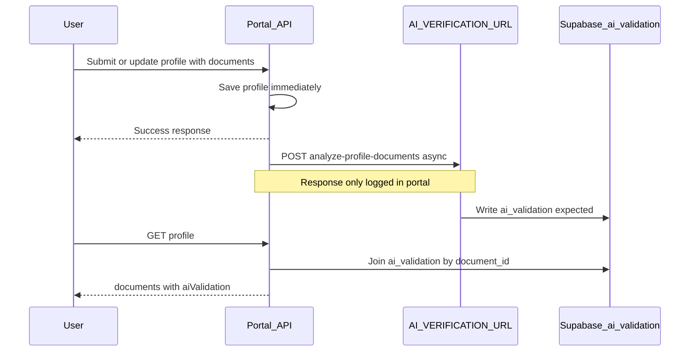

# Reports, Dashboard Metrics, and AI Features — Marketing Technical Summary

**Scope:** Verified against `client/src` and `server/src` only. No speculation on roadmap items.

**Auth model (applies throughout):**
- **Frontend `RoleRoute`:** exact role match via `hasAnyExactAccessRole` ([`client/src/components/ProtectedRoute.tsx`](../client/src/components/ProtectedRoute.tsx), [`client/src/lib/auth.ts`](../client/src/lib/auth.ts)).
- **Backend `authorizeRoles(["recruiter"])`:** expands `recruiter` to all of `RECRUITER_ACCESS_ROLES`: `recruiter`, `bookkeeper`, `recruiter_manager`, `accountant_manager`, `sales`, `recruiter_director` ([`server/src/middleware/auth.ts`](../server/src/middleware/auth.ts)).

---

## 1. Reports

### 1.1 Reports hub (index)

| Item | Detail |
|------|--------|
| **Route** | `/reports` |
| **Page** | [`client/src/pages/Reports/Reports.tsx`](../client/src/pages/Reports/Reports.tsx) |
| **Styles** | [`client/src/styles/pages/Reports.css`](../client/src/styles/pages/Reports.css) |
| **Routes** | [`client/src/App.tsx`](../client/src/App.tsx) — wrapped in `RoleRoute` with `REPORTS_ROLES` |
| **Menu** | [`client/src/components/HamburgerMenu.tsx`](../client/src/components/HamburgerMenu.tsx) — "Reports & Analytics" → `/reports` |

**Structure:** Three categories with clickable cards (no separate `ReportHub` component):

1. **Timesheets & Payroll** — Weekly Timesheet, Deduction Report  
2. **Sales & Invoices** — Invoice Report, Sales Report, Rate List, Margin Report  
3. **Printing & Clients** — Envelope Printing (Position Details), Envelope Printing (By Due Date), Clients  

**User sees:** Header, subtitle, category headings, cards with icon/title/description; click navigates to report route.

**Frontend access (`REPORTS_ROLES` in [`client/src/constants/accessControl.ts`](../client/src/constants/accessControl.ts)):**
- `admin`
- `bookkeeper`
- `accountant_manager`
- `recruiter_director`

**Backend access (all `POST /api/reports/*`):** `authorizeRoles(["admin", "recruiter"])` → admin + expanded recruiter family ([`server/src/routes/reports.ts`](../server/src/routes/reports.ts)).

**Role mismatches (marketing caution):**

| Role | Reports UI | Reports API |
|------|------------|-------------|
| `recruiter_manager` | No | Yes |
| `sales` | No | Yes |
| Plain `recruiter` | No | Yes |
| `bookkeeper` | Yes | Yes |
| `recruiter_director` | Yes | Yes |

**Status:** **Fully working.** No coming-soon or stub cards in the Reports module.

**Partial / coming-soon:** **None** under Reports. (`ComingSoonModal` exists only for Training Modules elsewhere.)

---

### 1.2 Shared report behavior

| Concern | Implementation |
|---------|----------------|
| API client | [`client/src/services/api/reports.ts`](../client/src/services/api/reports.ts) |
| Server router | [`server/src/routes/reports.ts`](../server/src/routes/reports.ts) — mounted at `/api/reports` in [`server/src/index.ts`](../server/src/index.ts) |
| UI styles | [`client/src/styles/pages/CommonReportsStyles.css`](../client/src/styles/pages/CommonReportsStyles.css) |
| CSV export | **Client-side only** — [`client/src/utils/csvExport.ts`](../client/src/utils/csvExport.ts); "Download CSV" when rows exist; **no server CSV endpoints** |
| Inactive highlighting | Several reports flag `client_is_inactive` (30-day rule) and `jobseeker_is_inactive` (60-day rule) in server logic |

---

### 1.3 Individual reports (all nine working)

#### Weekly Timesheet
- **Route:** `/reports/weekly-timesheet` — [`client/src/pages/Reports/WeeklyTimesheet.tsx`](../client/src/pages/Reports/WeeklyTimesheet.tsx)
- **API:** `POST /api/reports/timesheet`
- **Required filters:** Job seeker; at least one week period
- **Optional filters:** Clients, pay cycle, list name
- **Columns (high level):** Employee ID, license/passport, name, contact, company, list, title, position code/category, client manager, week dates, hours, pay rates, pay/bonus/deduction/cash deduction, HST/GST, currency, payment method, pay cycle, notes, timesheet created, invoice number; inactive flags
- **CSV:** `Weekly Timesheet Report.csv` — **works**
- **Smart behavior:** Cash/e-Transfer deduction aligned with timesheet email logic; week-period OR filtering

#### Deduction Report
- **Route:** `/reports/deduction` — [`DeductionReport.tsx`](../client/src/pages/Reports/DeductionReport.tsx)
- **API:** `POST /api/reports/deduction`
- **Required:** Start date, end date
- **Columns:** Invoice #, client, accounting person, total amount, jobseeker deductions, total deductions, invoice date
- **CSV:** `Deduction Report.csv` — **works**
- **Data:** Invoice lines with negative bill rates

#### Invoice Report
- **Route:** `/reports/invoice` — [`InvoiceReport.tsx`](../client/src/pages/Reports/InvoiceReport.tsx)
- **API:** `POST /api/reports/invoice`
- **Required:** Start date, end date
- **Optional:** Clients (multi-select)
- **Columns:** Invoice #, client, contact, terms, invoice/due dates, total, currency, email sent (+ date); client inactive flag
- **CSV:** `Invoice Report.csv` — **works**

#### Sales Report
- **Route:** `/reports/sales` — [`SalesReport.tsx`](../client/src/pages/Reports/SalesReport.tsx)
- **API:** `POST /api/reports/sales`
- **Required:** At least one client
- **Optional:** Start/end date, jobseekers, sales persons
- **Columns:** Client, contact, sales person, invoice #, from/to dates, invoice/due dates, terms, position line items (category, jobseeker #/name, description, hours, bill rate, amount, discount, tax, GST/HST, total, currency); status column in UI; inactive flags
- **CSV:** `Sales Report.csv` — **works**

#### Rate List
- **Route:** `/reports/rate-list` — [`RateList.tsx`](../client/src/pages/Reports/RateList.tsx)
- **API:** `POST /api/reports/rate-list`
- **UI requires:** At least one client (API can return all non-draft positions if client list empty)
- **Columns:** Client, position details, category, bill/pay/premium/overtime rates; client inactive flag
- **CSV:** `Rate List.csv` — **works**

#### Margin Report
- **Route:** `/reports/margin` — [`MarginReport.tsx`](../client/src/pages/Reports/MarginReport.tsx)
- **API:** `POST /api/reports/margin`
- **Required:** Start date, end date
- **Columns:** Invoice #, client, accounting person, total billed, paid amount, paid breakdown by payment method (cash, corp cheque, corp DD, e-Transfer, DD, cheque), margin amount/%, invoice date
- **CSV:** `Margin Report.csv` — **works**
- **Smart behavior:** Margin from subtotal vs jobseeker pay with payment-method splits

#### Envelope Printing (Position Details)
- **Route:** `/reports/envelope-printing-position` — [`EnvelopePrintingReport.tsx`](../client/src/pages/Reports/EnvelopePrintingReport.tsx)
- **API:** `POST /api/reports/envelope-printing-position`
- **Required:** At least one client
- **Optional:** Start/end date (defaults last month → today), list name, pay cycle
- **Columns:** Sequence, SR no (short code + week ending + sequence), city, list, week ending, client, sales person, short code, province, pay cycle, jobseeker ID/docs/name/phone/email, billing email, pay method, position, hours/OT, rates, amounts, tax, invoice #/date, payment due, currency; inactive flags
- **CSV:** `Envelope Printing Report.csv` — **works**
- **Smart behavior:** Matches timesheet lines to invoices; builds envelope serial numbers; payment due date computation

#### Envelope Printing (By Due Date)
- **Route:** `/reports/envelope-printing-by-due-date` — [`EnvelopePrintingByDueDateReport.tsx`](../client/src/pages/Reports/EnvelopePrintingByDueDateReport.tsx)
- **API:** `POST /api/reports/envelope-printing-by-due-date`
- **Required:** At least one client
- **Optional:** Payment due date range, list name, pay cycle
- **Columns:** Sequence, SR no, invoice #, city, list, week ending, client, sales person, short code, work province, pay cycle, jobseeker ID, license/passport, jobseeker name, phone, email, billing email, pay method, position category, position name, hours/OT, pay/bill rates, total pay/bill, tax, invoice date, payment due date, currency
- **CSV:** `Envelope Printing By Due Date Report.csv` — **works**
- **Smart behavior:** Groups timesheets and envelope batches by invoice payment due date for financial distribution workflows

#### Clients Report
- **Route:** `/reports/clients` — [`ClientsReport.tsx`](../client/src/pages/Reports/ClientsReport.tsx)
- **API:** `POST /api/reports/clients`
- **Filters:** Loads all non-draft clients on mount; optional client manager, payment method, terms (defaults: all payment methods and terms selected)
- **Columns:** Company/billing name, short code, list, accounting/sales/client manager, contact, email, mobile, address, payment method, pay cycle, terms, notes
- **CSV:** `Clients Report.csv` — **works**

---

## 2. Dashboard metrics and analytics

### 2.1 Routing and which dashboard users see

| File | Role |
|------|------|
| [`client/src/pages/Dashboard/Dashboard.tsx`](../client/src/pages/Dashboard/Dashboard.tsx) | Picks dashboard by auth flags |
| [`client/src/App.tsx`](../client/src/App.tsx) | `/dashboard` under `ProtectedRoute` only (no `RoleRoute`) |

**Selection order (important for buyers):**
1. If `isRecruiter` → **RecruiterDashboard** ([`RecruiterDashboard.tsx`](../client/src/pages/Dashboard/RecruiterDashboard.tsx))
2. Else if `isAdmin` → **AdminDashboard** ([`AdminDashboard.tsx`](../client/src/pages/Dashboard/AdminDashboard.tsx))
3. Else → **JobSeekerDashboard** ([`JobSeekerDashboard.tsx`](../client/src/pages/Dashboard/JobSeekerDashboard.tsx))

`isRecruiter` matches **all** `RECRUITER_ACCESS_ROLES` (bookkeeper, sales, managers, etc.). **Recruiter is checked before admin** — a user with both admin and recruiter-family roles sees **Recruiter**, not Admin.

**Menu:** `DASHBOARD_ROLES` = all internal staff + jobseeker ([`accessControl.ts`](../client/src/constants/accessControl.ts)).

---

### 2.2 Admin dashboard

**Status:** **Working** for org-wide aggregates. Several toggles are **decorative** (no `checked`/`onChange`).

**Sections (top → bottom):**

| Section | Components | API | Notes |
|---------|------------|-----|-------|
| Jobseeker metrics (4 cards) | `MetricGrid` / `MetricCard` | `GET /api/metrics/recruiters?timeRange=12` | Total, pending, verified, rejected profiles; 12-month `historicalData`; `redirectTo` `/jobseeker-management` |
| Recent activities | `RecentActivities` | Supabase direct (see §2.4) | Real-time feed |
| Document expiry | `ExpiryStatusOverview` | `GET /api/metrics/jobseekers/expiry-status-counts` | SIN + work permit buckets |
| Position metrics (3) | `MetricGrid` | `GET /api/metrics/recruiters/positions` | Positions added, slots, filled |
| Invoice metrics (5) | `MetricGrid` | `GET /api/invoice-metrics` | **Admin dashboard only** |
| Timesheet metrics (6) | `MetricGrid` | `GET /api/timesheet-metrics` | **Admin dashboard only** |
| AI insights | `MetricGrid` + `AISummary` | `GET /api/ai/insights`, `GET /api/ai/insights/timerange` | **Partial** (§2.6) |
| Client metrics (1 horizontal card) | `MetricCard` `showGraph={true}` | `GET /api/metrics/recruiters/clients` | Total clients; graph on by default |

**Invoice metric IDs** ([`server/src/routes/invoiceMetrics.ts`](../server/src/routes/invoiceMetrics.ts)): total invoices, total billed, hours billed, invoices with/without email sent; 12-month history.

**Timesheet metric IDs** ([`server/src/routes/timesheetMetrics.ts`](../server/src/routes/timesheetMetrics.ts)): total timesheets, total jobseeker pay, bonus, deduction, regular hours, overtime hours; 12-month history.

**Charts/trends:** API returns `historicalData`. Grid cards default `showGraph={false}`; user expands per card to see `MetricChart` ([`client/src/components/dashboard/MetricChart.tsx`](../client/src/components/dashboard/MetricChart.tsx)).

**Admin-only quirks:**
- `DataViewToggle` labels imply "all recruiters" but **always loads org-wide** APIs (no toggle wiring).
- `handleMetricClick` mostly `console.log`s; navigation relies on `MetricCard` `redirectTo` where set.

**Backend:** Metrics routes use `authorizeRoles(["admin", "recruiter"])` — broader than who sees Admin UI.

---

### 2.3 Recruiter-family dashboard

**Who gets it:** Anyone with `isRecruiter` (bookkeeper, sales, recruiter_manager, etc.).

**Status:** **Working** with personal vs organization toggle on jobseeker, position, and client sections.

| Section | vs Admin | Personal / org toggle |
|---------|----------|------------------------|
| Jobseeker metrics (4) | Same metrics | **Working** — `GET .../recruiters/:userId` vs `GET .../recruiters` |
| Recent activities | Same | — |
| Document expiry | Same | — |
| Position metrics (3) | Same | **Working** — per-user vs all |
| AI insights | Same | **No scope toggle** — always org-wide AI APIs |
| Client metrics | Same | **Working** toggle |
| Invoice / timesheet metrics | **Absent** | — |

**Client APIs:** [`client/src/services/api/recruiterMetrics.ts`](../client/src/services/api/recruiterMetrics.ts), [`timesheetMetrics.ts`](../client/src/services/api/timesheetMetrics.ts), [`invoiceMetrics.ts`](../client/src/services/api/invoiceMetrics.ts), [`aiInsights.ts`](../client/src/services/api/aiInsights.ts).

**Server:** [`server/src/routes/recruiterMetrics.ts`](../server/src/routes/recruiterMetrics.ts), [`jobseekerMetrics.ts`](../server/src/routes/jobseekerMetrics.ts), [`timesheetMetrics.ts`](../server/src/routes/timesheetMetrics.ts), [`invoiceMetrics.ts`](../server/src/routes/invoiceMetrics.ts), [`aiInsights.ts`](../server/src/routes/aiInsights.ts).

---

### 2.4 Real-time activity feed

| Layer | Path |
|-------|------|
| Hook | [`client/src/hooks/useRecentActivities.ts`](../client/src/hooks/useRecentActivities.ts) |
| UI | [`client/src/components/dashboard/RecentActivities.tsx`](../client/src/components/dashboard/RecentActivities.tsx) |
| Writer | [`server/src/middleware/activityLogger.ts`](../server/src/middleware/activityLogger.ts) |

**How it works:**
1. Initial load: Supabase `recent_activities`, `is_deleted = false`, newest first, limit 10.
2. **Realtime:** `postgres_changes` on `public.recent_activities` (INSERT/UPDATE/DELETE).
3. **Pagination:** "Load 20 more" via `.range`.
4. **UI:** Live/Connecting badge, formatted `display_message`, category badges, retry.

**Shown on:** Admin and Recruiter dashboards only (not jobseeker).

**Status:** **Working** (depends on Supabase RLS/realtime and rows from `activityLogger` on mutating routes: clients, positions, jobseekers, timesheets, invoices, consent, users, auth, etc.).

**`action_type` values (logged + displayed):** Includes jobseeker/client/position/timesheet/invoice CRUD, drafts, bulk timesheet ops, email sends, user role/manager updates, consent events, registration — full list in `useRecentActivities.ts` types.

**Categories:** `position_management`, `client_management`, `financial`, `system`, `candidate_management`, `user_management`.

**Buyer-relevant automation:** Feed is **audit-style**, not alerting — no push/email from the feed itself.

---

### 2.5 Document expiry overview widget

| Item | Path |
|------|------|
| Component | [`client/src/components/dashboard/ExpiryStatusOverview.tsx`](../client/src/components/dashboard/ExpiryStatusOverview.tsx) |
| API | `GET /api/metrics/jobseekers/expiry-status-counts` — [`server/src/routes/jobseekerMetrics.ts`](../server/src/routes/jobseekerMetrics.ts) |
| Client | [`client/src/services/api/jobseekerMetrics.ts`](../client/src/services/api/jobseekerMetrics.ts) |

**User sees:** Two panels (SIN, Work Permit) with buckets: expired, ≤30/60/90 days, after 90 days, plus profiles-with-data count.

**Interaction:** Clicking a panel navigates to `/sin-work-permit-management` (whole panel — not per-bucket deep links).

**Access:** Admin + Recruiter dashboards. Backend: `authorizeRoles(["admin", "recruiter"])`. Frontend SIN page: `SIN_WORK_PERMIT_ROLES` (admin, recruiter, recruiter_manager, recruiter_director).

**Status:** **Working** — counts from `jobseeker_profiles.sin_expiry` / `work_permit_expiry`. **No** automated expiry notifications in this widget.

---

### 2.6 AI insights on dashboard

| Layer | Path |
|-------|------|
| UI | `AISummary` + metric cards in Admin/Recruiter dashboards |
| Server | [`server/src/routes/aiInsights.ts`](../server/src/routes/aiInsights.ts) — `/api/ai/insights`, `/api/ai/insights/timerange` |
| Client | [`client/src/services/api/aiInsights.ts`](../client/src/services/api/aiInsights.ts) |

**What works:**
- **Summary (`AISummary`):** `totalDocumentsScanned` = row count of `ai_validation`; `totalJobseekersMatched` = sum of `positions.number_of_positions`.
- **Current values on metric cards:** Same sources.
- **Monthly chart for "jobseekers matched":** Built from `positions.created_at` in timerange — **works**.

**What is partial / misleading for marketing:**
- **"Documents scanned" monthly trend:** Aggregation code is **commented out** with a stale TODO; monthly `documentsScanned` stays **0** in charts even though migration `012` defines `ai_validation.created_at` ([`server/src/db/migration_v2/012_ai_validation_from_godspeed_ops_ai.sql`](../server/src/db/migration_v2/012_ai_validation_from_godspeed_ops_ai.sql)).
- **Label "jobseekers matched":** Counts **position slot totals**, not embedding matches or assignments.
- **Recruiter dashboard:** AI block has **no** personal/org toggle — always organization-wide.

**Backend access:** `authorizeRoles(["admin", "recruiter"])` — bookkeeper can hit API if they call it, but they use Recruiter dashboard UI which includes this section.

**Overall:** **Partial** — headline totals credible; document trend chart and "matched" wording need careful marketing language.

---

### 2.7 Jobseeker dashboard (brief)

**Path:** [`JobSeekerDashboard.tsx`](../client/src/pages/Dashboard/JobSeekerDashboard.tsx)

**Shows:** Assignment metrics (`GET /api/metrics/jobseekers/:candidateId`), `ProfileCompletion` — **no** activity feed, expiry widget, AI insights, invoice/timesheet.

**Status:** **Working** for verified jobseekers with profile.

---

### 2.8 Dashboard status matrix

| Feature | Admin UI | Recruiter-family UI | Jobseeker |
|---------|----------|---------------------|-----------|
| Profile metrics + history | Working (org) | Working (toggle) | Working (self) |
| Position metrics | Working | Working (toggle) | — |
| Client metrics + graph | Working | Working (toggle) | — |
| Invoice metrics | Working | — | — |
| Timesheet metrics | Working | — | — |
| Activity feed | Working | Working | — |
| Expiry widget | Working | Working | — |
| AI summary totals | Working | Working | — |
| AI doc monthly chart | Stub (zeros) | Stub | — |
| AI position monthly chart | Working | Working | — |
| Admin data toggles | Decorative | N/A | — |

---

## 3. AI features

### 3.1 AI document verification

**Flow:**

| Item | Path |
|------|------|
| Trigger (create) | [`server/src/routes/profile.ts`](../server/src/routes/profile.ts) — `POST /api/profile/submit` |
| Trigger (update) | [`server/src/routes/jobseekers.ts`](../server/src/routes/jobseekers.ts) — `PUT /api/jobseekers/profile/:id/update` |
| Read merge | `GET /api/jobseekers/profile/:id` in same file |
| External URL | `AI_VERIFICATION_URL` or default Heroku `analyze-profile-documents` ([`server/.env.example`](../server/.env.example)) |
| Schema | [`server/src/db/migration_v2/012_ai_validation_from_godspeed_ops_ai.sql`](../server/src/db/migration_v2/012_ai_validation_from_godspeed_ops_ai.sql) |

**Returns to UI (`ai_response` fields used):** `document_authentication_percentage`, `is_tampered`, `is_blurry`, `is_text_clear`, `is_resubmission_required`, `notes`; types in [`client/src/types/jobseeker.ts`](../client/src/types/jobseeker.ts).

**Where results appear:**
- [`client/src/pages/JobseekerManagement/JobSeekerProfile.tsx`](../client/src/pages/JobseekerManagement/JobSeekerProfile.tsx) — per-document gauge, quality flags, notes; profile-level "needs attention" badge.
- [`client/src/pages/JobseekerManagement/JobSeekerManagement.tsx`](../client/src/pages/JobseekerManagement/JobSeekerManagement.tsx) — list "needs attention" for pending profiles **likely broken** because list API does not include `documents` / `aiValidation`.

**Manual verification (not AI):** Recruiters set `verification_status` via `PUT /api/jobseekers/profile/:id/status`; employee ID on verify.

**Frontend access to profile UI:** `JOBSEEKER_LIST_ROLES` in App.tsx (admin, recruiter, bookkeeper, recruiter_manager, accountant_manager, recruiter_director).

**Status:** **Partial** — end-to-end only if external AI service writes `ai_validation`; portal never blocks user on AI failure; POST response unused.

**Buyer-relevant:** Async fire-and-forget; no in-app retry/status for AI job itself beyond "validation in progress" when `aiValidation` is null.

---

### 3.2 AI candidate matching (summary only)

**Not a separate Reports feature** — detail belongs in placements/position-matching marketing doc ([`positions-matching-calendar-marketing-report.md`](positions-matching-calendar-marketing-report.md)).

| Item | Path |
|------|------|
| RPC | [`server/src/db/functions/find_matching_candidates.sql`](../server/src/db/functions/find_matching_candidates.sql) |
| API | `GET /api/jobseekers/position-candidates/:positionId` — [`server/src/routes/jobseekers.ts`](../server/src/routes/jobseekers.ts) |
| UI | [`client/src/pages/PositionManagement/PositionMatching.tsx`](../client/src/pages/PositionManagement/PositionMatching.tsx) |
| Embeddings | [`server/src/db/migration_v2/011_embeddings.sql`](../server/src/db/migration_v2/011_embeddings.sql) |

**Mechanism:** Cosine similarity on `bio_embedding` / `job_embedding` (pgvector), not in-request LLM.

**Frontend:** `POSITION_MATCHING_ROLES` — admin, recruiter, recruiter_manager, recruiter_director.

**Backend:** `isAdminOrRecruiter` (expanded recruiter family).

**Mismatch:** Bookkeeper/sales may call API but cannot open `/position-matching` in UI.

**Status:** **Partial** — works when embeddings exist; RPC hardcodes `is_available = TRUE` (availability filter weak); "Available only" UI commented out.

**For this doc vs placements report:** Mention only as "embedding-based candidate ranking on Position Matching page"; defer filters, columns, and workflow to placements report.

---

### 3.3 AI chat — iframe (active)

| Item | Detail |
|------|--------|
| Page | [`client/src/pages/GodspeedAIChat.tsx`](../client/src/pages/GodspeedAIChat.tsx) |
| Component | [`client/src/components/IframeViewer.tsx`](../client/src/components/IframeViewer.tsx) |
| Route | `/ai-chat` — [`client/src/App.tsx`](../client/src/App.tsx) |
| URL | `VITE_AI_CHAT_URL` or default `https://godspeed-ops-ai-mhbl.onrender.com/` |
| Menu title | "AllStaff AI Chat" |

**Frontend access:** `AI_CHAT_ROLES` = all `INTERNAL_STAFF_ROLES` (admin, recruiter, bookkeeper, recruiter_manager, accountant_manager, sales, recruiter_director).

**Backend:** None in portal — capabilities entirely in embedded app.

**User can:** Open full-page iframe chat; **cannot** from portal alone describe SQL/RAG limits — those live in external service.

**Status:** **Working** as iframe shell.

---

### 3.4 Floating AI chat widget (inactive)

| Item | Detail |
|------|--------|
| Component | [`client/src/components/FloatingChat.tsx`](../client/src/components/FloatingChat.tsx) |
| Styles | [`client/src/styles/components/floating-chat.css`](../client/src/styles/components/floating-chat.css) |
| Mount | **Commented out** in [`client/src/App.tsx`](../client/src/App.tsx) (`{/* <FloatingChat /> */}`) |
| API | `POST https://godspeed-ops-ai-1ba0.onrender.com/chat/stream` (SSE-style) |
| Auth | Supabase Bearer per message |
| Payload | `session_id`, `user_type`, `user_question`, `message_history` (last 10) |
| If enabled, visible to | `userType === 'admin' \|\| userType === 'recruiter'` only (**stricter** than iframe page; excludes bookkeeper by base user type) |

**Built capabilities (from component):** NL → SQL against operational data; stages (analyzing, generating, etc.); may surface `sql_query`, token usage in metadata; markdown rendering with `sanitize: false`.

**Status:** **Built but disabled** — different host than iframe chat (`godspeed-ops-ai-1ba0` vs `godspeed-ops-ai-mhbl`).

**Marketing:** Do **not** claim floating widget is live; iframe chat is the production entry point.

---

### 3.5 Other AI-adjacent items

| Item | AI? | Note |
|------|-----|------|
| Dashboard AI insights | Yes | See §2.6 |
| Embedding queue | Infrastructure | Conditional on external `util.queue_embeddings()` |
| Invoice `search_vector` | No | Postgres FTS, not semantic AI |
| Training modules | No | Video / coming soon only |

---

## 4. Cross-cutting gaps (accuracy for buyers)

1. **Reports API wider than Reports UI** — do not claim all recruiters see Reports unless role is one of four `REPORTS_ROLES`.
2. **Admin + recruiter role** — users see Recruiter dashboard, not Admin (lose invoice/timesheet dashboard widgets unless sole admin).
3. **AI insights labels** — "matched" = position slots; document trend chart flat until server enables `created_at` aggregation (field exists in schema).
4. **AI verification** — depends on external service + DB writes; list "needs attention" unreliable.
5. **Two chat products** — iframe (staff-wide, live) vs native widget (admin/recruiter only, off).
6. **No server-side CSV** for reports — export is browser download of current table rows.
