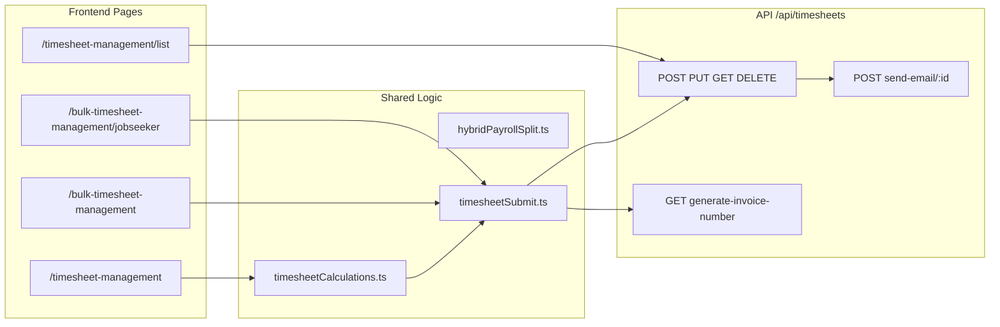

# Timesheet and Payroll — Functional & Technical Summary

This report reflects **what exists in the codebase today**, not roadmap items. Sources: [`client/src/pages/TimesheetManagement/`](../client/src/pages/TimesheetManagement/), [`server/src/routes/timesheet.routes.ts`](../server/src/routes/timesheet.routes.ts), [`server/src/services/timesheet.service.ts`](../server/src/services/timesheet.service.ts), [`client/src/lib/hybridPayrollSplit.ts`](../client/src/lib/hybridPayrollSplit.ts), and related files.

---

## Module map

### Core file index

| Area | Key paths |
|------|-----------|
| Routes (UI) | [`client/src/App.tsx`](../client/src/App.tsx) |
| Access control | [`client/src/constants/accessControl.ts`](../client/src/constants/accessControl.ts) |
| Single entry page | [`client/src/pages/TimesheetManagement/TimesheetManagement.tsx`](../client/src/pages/TimesheetManagement/TimesheetManagement.tsx) |
| Read-only view page | [`client/src/pages/TimesheetManagement/TimesheetView.tsx`](../client/src/pages/TimesheetManagement/TimesheetView.tsx) |
| Bulk by client | [`client/src/pages/TimesheetManagement/BulkTimesheetManagement.tsx`](../client/src/pages/TimesheetManagement/BulkTimesheetManagement.tsx) |
| Bulk by jobseeker | [`client/src/pages/TimesheetManagement/BulkTimesheetJobseekerManagement.tsx`](../client/src/pages/TimesheetManagement/BulkTimesheetJobseekerManagement.tsx) |
| All timesheets list | [`client/src/pages/TimesheetManagement/TimesheetList.tsx`](../client/src/pages/TimesheetManagement/TimesheetList.tsx) |
| Payroll engine | [`client/src/lib/hybridPayrollSplit.ts`](../client/src/lib/hybridPayrollSplit.ts), [`client/src/pages/TimesheetManagement/functions/timesheetCalculations.ts`](../client/src/pages/TimesheetManagement/functions/timesheetCalculations.ts) |
| Submit orchestration | [`client/src/pages/TimesheetManagement/functions/timesheetSubmit.ts`](../client/src/pages/TimesheetManagement/functions/timesheetSubmit.ts) |
| Week/prefill helpers | [`client/src/pages/TimesheetManagement/functions/timesheetWeek.ts`](../client/src/pages/TimesheetManagement/functions/timesheetWeek.ts) |
| Client API | [`client/src/services/api/timesheet.ts`](../client/src/services/api/timesheet.ts) |
| Server routes | [`server/src/routes/timesheet.routes.ts`](../server/src/routes/timesheet.routes.ts) |
| Server controller | [`server/src/controllers/timesheet.controller.ts`](../server/src/controllers/timesheet.controller.ts) |
| Server service | [`server/src/services/timesheet.service.ts`](../server/src/services/timesheet.service.ts) |
| Versioning service | [`server/src/services/timesheet.version.ts`](../server/src/services/timesheet.version.ts) |
| Email builders | [`server/src/services/timesheet.email.ts`](../server/src/services/timesheet.email.ts), [`server/src/email-templates/timesheet-html.ts`](../server/src/email-templates/timesheet-html.ts), [`server/src/email-templates/timesheet-txt.ts`](../server/src/email-templates/timesheet-txt.ts) |
| DB schema | [`server/src/db/migration_v2/005_timesheets.sql`](../server/src/db/migration_v2/005_timesheets.sql), [`018_hybrid_payment_timesheets.sql`](../server/src/db/migration_v2/018_hybrid_payment_timesheets.sql), [`024_timesheets_bulk_jobseeker.sql`](../server/src/db/migration_v2/024_timesheets_bulk_jobseeker.sql), [`025_timesheets_tax_amount.sql`](../server/src/db/migration_v2/025_timesheets_tax_amount.sql) |
| i18n | [`client/src/contexts/language/locales/en/timesheet.json`](../client/src/contexts/language/locales/en/timesheet.json), [`fr/timesheet.json`](../client/src/contexts/language/locales/fr/timesheet.json) |

---

## Role access (frontend vs backend)

### Frontend route guards (`RoleRoute` in App.tsx)

| Route | Allowed roles |
|-------|---------------|
| `/timesheet-management` | `admin`, `recruiter`, `bookkeeper`, `recruiter_manager`, `recruiter_director` |
| `/bulk-timesheet-management` | `admin`, `bookkeeper` |
| `/bulk-timesheet-management/jobseeker` | `admin`, `bookkeeper` |
| `/timesheet-management/list` | `admin`, `bookkeeper` |

Constants: `TIMESHEET_MANAGEMENT_ROLES`, `BULK_TIMESHEET_ROLES` in [`accessControl.ts`](../client/src/constants/accessControl.ts).

Frontend uses **exact role matching** — no expansion.

### Backend API (`authorizeRoles(["admin", "recruiter", "jobseeker"])` on all timesheet routes)

The `"recruiter"` token expands via `RECRUITER_ACCESS_ROLES` in [`server/src/middleware/auth.ts`](../server/src/middleware/auth.ts) to also include: **bookkeeper**, **recruiter_manager**, **accountant_manager**, **sales**, **recruiter_director**.

**Effective API access:** admin + all expanded internal roles + jobseekers (scoped to own data on reads/writes).

### Mismatches to flag

- **List page vs API:** Only admin/bookkeeper see `/timesheet-management/list`, but recruiters (and sales, accountant_manager) can call `GET /api/timesheets` and receive the full list.
- **Bulk UI vs API:** Bulk create pages are admin/bookkeeper only; API create/update is available to all expanded internal roles.
- **Single timesheet UI vs API:** UI lists recruiter roles explicitly; **sales** and **accountant_manager** have API access but no timesheet UI route.
- **Jobseeker:** No timesheet UI routes; API scoped to own `jobseeker_user_id`.
- **Delete:** `DELETE /api/timesheets/:id` works on backend; list UI delete is stubbed (see List section).

---

## 1. Single timesheet entry (`/timesheet-management`)

### Files involved

- **Page:** `TimesheetManagement.tsx`
- **Hooks:** `useTimesheetSelection`, `useJobseekerWeekTimesheets`, `useWeeklyTimesheetForm`, `useTimesheetSubmit`, `useTimesheetFormTranslation`
- **Components:** `TimesheetSelectionBar`, `TimesheetFormCard`, `TimesheetUnifiedHeader`, `TimesheetJobseekerInfoPanel`, `TimesheetDailyHoursGrid`, `TimesheetPayAdjustments`, `TimesheetPositionPayInfo`, `TimesheetNotesSection`, `TimesheetInvoiceSummary`, `TimesheetInvoiceTotals`, `TimesheetSubmitSection`, `TimesheetEmptyState`, `TimesheetFormSkeleton`
- **API calls:** `getJobseekerProfiles`, `getClients`, `getClientPositions`, `getJobseekerTimesheets`, `generateInvoiceNumber`, `createTimesheet`, `updateTimesheet`

### Step-by-step user flow

1. **Page load** — Fetches all jobseekers and builds 52 Sunday–Saturday week options.
2. **Select jobseeker** — Clears client and position; loads **all clients** (not filtered by assignment to that jobseeker).
3. **Select client** — Clears position; loads positions for client via `getClientPositions(clientId, { showAllSiblings: "true" })` (includes sibling/subcategory positions in dropdown).
4. **Select position** — No further cascade reset.
5. **Select week** — Week dropdown is always enabled; data fetch waits until jobseeker + position + week are all set.
6. **Load existing data** — `GET /api/timesheets/jobseeker/:userId?dateRangeStart=&dateRangeEnd=` filtered to selected `position_id`.
7. **Form renders** when all four selections are made and week fetch completes.
8. **If existing timesheet found** — Daily hours, bonus, deduction, notes prefilled; button shows **Update Timesheet**; updates use existing row ID(s).
9. **If no existing timesheet** — Empty 7-day grid; optional pre-fetch of invoice number for display (falls back to `"TBD"` on failure); button shows **Generate Timesheet**.
10. **Edit** — User enters hours, optional bonus/deduction/notes; live payroll preview recalculates instantly.
11. **Submit** — Requires ≥ 1 total hour (regular + OT). Creates or updates via API; optional email checkbox.

**Empty states:** No clients → empty state variant `"clients"`; no positions → `"positions"`.

**When combination already has a timesheet:** Existing row(s) load into the form. Hybrid payment methods may produce 1–2 DB rows (`pay_split_segment`: `single`, `sin`, `cash`, `e_transfer`); IDs stored in `existingTimesheetId` or `splitExistingIds`. Submit performs **update**, not duplicate create.

### Daily hours grid

Per day (Sun–Sat for selected week):

- **Date** — read-only label (weekday + date)
- **Hours** — number input, min 0, 2 decimal places, empty displays as 0
- **Overtime hours** — internal only; computed proportionally across days when position has OT enabled and weekly OT > 0; **not user-editable**

### Live payroll preview

**Engine:** `calculateTimesheetTotals` / `getPayrollPreviewRows` → `buildTimesheetRowsForPayroll` in `hybridPayrollSplit.ts`.

**Rate resolution:**

- Effective pay rate = regular pay rate + premium pay rate (from position)
- OT rates from position when `overtimeEnabled`
- Bill rates from position
- OT threshold from `position.overtimeHours` (default 40)

**Display components:**

- **`TimesheetInvoiceSummary`** — line items: regular hours, OT hours, hybrid segment splits (SIN vs cash/e-Transfer), bonus, deduction
- **`TimesheetInvoiceTotals`** — total hours, subtotal, cash deduction line (when applicable), bonus, deduction, final employee pay
- **`TimesheetPositionPayInfo`** — read-only sidebar: regular pay rate, premium pay rate (if > 0), OT pay rate (if enabled), OT threshold

Preview is **client-side only** — no server round-trip on each edit.

### Bonuses and deductions

- Component: `TimesheetPayAdjustments.tsx`
- **Bonus** — dollar amount, min 0, 2 decimals
- **Deduction** — dollar amount, min 0, 2 decimals
- **No description fields** — amounts only
- Applied on SIN segment for hybrid splits; on single row for standard methods

### Employee context panel

`TimesheetJobseekerInfoPanel` shows:

- Name, primary email, billing email, phone
- Employee ID
- Payment method
- For hybrid methods: "Paid as" line (`SIN-Direct Deposit + Cash` or `+ e-Transfer`)
- Cash deduction % (when payment method uses cash deduction)
- SIN payroll hours cap (when hybrid payment method)

### Pay adjustments and notes

- **Notes:** `TimesheetNotesSection` — free-text textarea, stored in `timesheets.notes`
- **Pay adjustments:** bonus/deduction amounts (see above)

### Optional email on save

- Checkbox: "Send timesheet via email to jobseeker"
- Note: "Email will be sent to billing email if provided, otherwise to primary email"
- **Recipient:** `billing_email` if set, else primary email (server: `timesheet.email.ts`)
- **Trigger:** `email_sent: true` in POST/PUT body → `emailNotifier` middleware sends after successful save
- **Skip if no email:** Email builder returns null if jobseeker has no email on profile
- **Template contents (HTML + plain text, English only):**
  - Jobseeker name and email
  - Position title
  - Week period (start — end)
  - Generated date
  - Daily hours table (date + hours per day)
  - Payment summary: regular hours/rate/pay, OT hours/rate/pay (if enabled), bonus, deductions, cash deduction % and amount (when applicable), total pay
  - "UPDATED" badge on update emails
  - Subject: `Timesheet #000123` or `Updated Timesheet #000123`
- **No PDF attachment** on timesheet emails

### Database writes and side effects on save

**Create** (no existing ID):

- `GET /api/timesheets/generate-invoice-number` → sequential 6-digit number
- `POST /api/timesheets` with full payload

**Update** (existing ID present):

- `PUT /api/timesheets/:id` — version incremented, version history appended

**Fields written:** jobseeker_profile_id, jobseeker_user_id, position_id, week_start/end dates, daily_hours (JSONB), total regular/OT hours, all rate fields, total_jobseeker_pay, total_client_bill, bonus/deduction amounts, notes, overtime_enabled, markup, email_sent, pay_split_segment, line_payment_method, invoice_number (create only)

**Uniqueness constraint:** `(jobseeker_profile_id, position_id, week_start_date, pay_split_segment)` — hybrid weeks can have 2 rows.

**Side effects:**

- Activity log: `create_timesheet` / `update_timesheet`
- Optional SendGrid email
- DB triggers: client/jobseeker inactivity monitor updates (migration 014)
- Client cache invalidation for `/api/timesheets`

### Status: fully working

Single entry path is end-to-end functional. Minor gaps:

- Client dropdown not assignment-filtered (unlike bulk flows)
- Success message email count is approximate (counts checked positions, not confirmed sends)
- Document upload API exists but is not wired on this page

---

## 2. Bulk timesheet — by client (`/bulk-timesheet-management`)

### Files involved

- **Page:** `BulkTimesheetManagement.tsx`
- **Hooks:** `useBulkTimesheetSelection`, `useBulkJobseekerWeekPrefetch`, `useBulkTimesheetForms`, `useBulkTimesheetSubmit`
- **Shared:** `timesheetSubmit.ts`, `timesheetWeek.ts`, `timesheetFormMap.ts`, `mapAssignmentToJobseeker.ts`
- **API:** `getClients`, `getClientPositions`, `getPositionAssignments`, `getJobseekerTimesheets`, standard timesheet CRUD

### Step-by-step user flow

1. **Select client** — all clients loaded; changing client resets position and assignees.
2. **Select position** — positions for client (including siblings via `showAllSiblings`).
3. **Select week** — 52 week options; independent of assignee load.
4. **Assigned jobseekers load automatically** — `GET /api/positions/:positionId/assignments`; **no manual worker selection**.
5. **Prefetch existing timesheets** — parallel fetch per assigned jobseeker for the selected week, filtered to position.
6. **Forms build** — one card per assignment with prefilled data (hours, bonus, deduction, notes, existing IDs).
7. **User edits** each worker card; can remove workers from batch (minus button; disabled when only 1 worker remains).
8. **Submit** — "Generate Bulk Timesheet" runs sequential per-worker submits.

**Forms appear when:** client + position + week + assignees exist + prefetch complete + at least one row.

**Note:** Cards are **always fully visible** — there is no expand/collapse accordion in code.

### Per-worker form contents

Each card includes the same building blocks as single entry:

- Employee context panel (row layout)
- Daily hours grid
- Pay adjustments (bonus/deduction)
- Position pay info
- Notes
- Invoice summary + totals (live preview)
- Per-worker "Send email" checkbox
- Global "Send to all" toggle in header

### Submit behavior

- Filters to rows with **total hours > 0**
- **Sequential loop** — one `submitWeeklyTimesheets` call per worker (not a dedicated bulk API)
- **One timesheet per worker** (or 1–2 DB rows for hybrid payment methods)
- **Unique invoice numbers** — generated individually per new row via `generateInvoiceNumber()`
- **Progress overlay:** fullscreen loader; shows `current/total` and worker name; displays latest successful invoice number; "do not close" message
- **Duplicate handling:** catches errors containing "already exists" or "duplicate"; shows 5s message; **continues** remaining workers
- **Partial failure:** success message reports successful vs failed counts; continues processing
- **All duplicates:** dedicated "all timesheets exist" message
- **All failed:** error with joined failure details
- **On full success:** success message, auto-reset selection after 8 seconds

**Updates vs creates:** Prefilled existing IDs cause update, avoiding duplicate errors.

### Invoice-only subcategory positions

When `selectedPosition.isSubcategory`:

- **Banner text:** "This is a subcategory position (invoicing only). It has no assigned jobseekers. Use the individual timesheet creation to create timesheets for this position."
- Subcategory positions remain selectable; typically shows empty assignee state.

### Remove worker from batch

- `removeJobseeker(assignmentId)` removes row from local state before submit
- Cannot remove last remaining worker (`rows.length === 1` disables minus button)

### Status: fully working

Bulk is a UI batch over standard CRUD — no separate `bulk_timesheets` table usage in app code (legacy table exists in migration 008 but is unused).

---

## 3. Bulk timesheet — by jobseeker (`/bulk-timesheet-management/jobseeker`)

### Files involved

- **Page:** `BulkTimesheetJobseekerManagement.tsx`
- **Hooks:** `useBulkJobseekerTimesheetSelection`, `useJobseekerWeekTimesheets`, `useBulkJobseekerPositionForms`, `useBulkTimesheetSubmit`
- **Component:** `BulkJobseekerPositionCard.tsx`

### Step-by-step user flow

1. **Select jobseeker** — all jobseekers loaded; resets client/week/positions on change.
2. **Select client** — all clients; loads all positions for that client (no assignment filter).
3. **Select week** — disabled until jobseeker + client selected.
4. **Auto-add one empty position row** when jobseeker + client + week ready.
5. **Add position rows** — "Add another position" prepends new empty row.
6. **Per row:** pick position from dropdown (same position cannot be selected twice).
7. **On position select:** hydrates form from existing week data for that jobseeker + position + week.
8. **Submit** — same sequential bulk submit as client flow; progress label uses position title + code.

### Prefilled data

- Single week fetch: `fetchJobseekerWeekTimesheets(userId, weekStart)` for entire week
- On position pick: `filterTimesheetsForWeekAndPosition` merges daily hours, bonus, deduction, notes, existing IDs
- New position with no existing data: may pre-fetch invoice number for display (`"TBD"` on failure)

### Add/remove position rows

- **Add:** prepends empty row
- **Remove:** minus button on card; disabled when only 1 row remains
- Subcategory positions: selectable with badge in dropdown; **no** full-page banner (unlike client bulk)

### Submit vs client bulk

Same `useBulkTimesheetSubmit` hook and `timesheetSubmit.ts` — identical duplicate/partial/progress/invoice logic. Differences:

- Rows = chosen positions (manual), not auto-loaded assignments
- Progress label = position title, not worker name
- Submit disabled while any row is hydrating (`hasRowHydratingForm`)
- Separate i18n namespace: `bulkJobseekerTimesheetManagement`

### Status: fully working

---

## 4. All timesheets list (`/timesheet-management/list`)

### Files involved

- **Page:** `TimesheetList.tsx`
- **Hook:** `useTimesheetsList.ts`
- **Components:** `TimesheetListTable.tsx`, `TimesheetListPagination.tsx`
- **API:** `GET /api/timesheets`, `POST /api/timesheets/send-email/:id`

### Filters (all working in UI + API)

| Filter | UI | Backend field |
|--------|-----|---------------|
| Invoice number | Column header text input | `invoice_number` ilike |
| Client | Column header text input | `positions.client_name` ilike |
| Position | Column header text input | `positions.title` ilike |
| Jobseeker | Column header text input | `jobseeker_profiles.first_name` ilike only |
| Billing email | Column header text input | `billing_email` ilike |
| Week period | Start/end date pickers | `week_start_date` / `week_end_date` range |
| Email status | Select: all / sent / not sent | `email_sent` eq |

**Partial/dead:**

- `searchTerm` — read from URL on load, sent to API, but **no UI field** and filters don't write back to URL
- Jobseeker filter matches **first name only** (not last name or email)

### Pagination

- Page sizes: 10, 25 (default), 50, 100
- 300ms debounced fetch on filter/page change
- Prev/next + up to 5 page buttons when `totalPages > 1`
- URL supports `?page=&limit=` on initial load
- **Display quirk:** "Showing X–Y of Z" uses unfiltered `total` even when filters applied

### Email send / resend per row

- Per-row "Send Email" button → `POST /api/timesheets/send-email/:id`
- **Resend:** same endpoint; no guard against already-sent
- **Recipient:** billing email preferred over primary
- **On success:** SendGrid send; `email_sent = true` in DB; UI optimistically updates row
- Activity log: `send_bulk_timesheet_email`
- Same email template as save-triggered emails (no PDF)

### Delete

- **UI:** `ConfirmationModal` exists in `TimesheetList.tsx` but **no delete button in table**; `handleConfirmDelete` in hook is an **empty placeholder**
- **Backend:** `DELETE /api/timesheets/:id` fully implemented with activity log — **not wired from list UI**

### Header shortcuts

- Primary button → `/bulk-timesheet-management` (bulk by client)
- Secondary button → `/bulk-timesheet-management/jobseeker`

### Other gaps

- No row click / edit navigation from list — editing requires returning to single or bulk entry pages
- "Total Pay" column header is **hardcoded English** (not translated)

### Status

List, filters, pagination, email send/resend: **fully working**. Delete from list: **stubbed**. Row edit from list: **not present**.

---

## 5. Cross-cutting behavior

### Invoice number generation

- **When:** On create only (not on update); also pre-fetched for display on new forms
- **How:** Max existing `invoice_number` in `timesheets`, parse as integer + 1, zero-pad to 6 digits (`000001` start)
- **Collision check:** Re-queries for duplicate; bumps if found
- **Sequential:** Global across all timesheets (not per client/worker)
- **Bulk:** One invoice number per created DB row (hybrid = 2 numbers per worker/week)

### `timesheetCalculations.ts` + `hybridPayrollSplit.ts`

Computes:

- Weekly regular vs overtime split (chronological per-day fill; threshold from position, default 40)
- Effective pay rate (regular + premium)
- Client bill totals
- Payment-method-specific splits and deductions
- Preview rows for UI display

### Payment methods (from `PAYMENT_METHODS` in `formOptions.ts`)

| Method | Payroll behavior |
|--------|------------------|
| **SIN-Direct Deposit** | Single row; standard pay ± bonus/deduction |
| **Cash** | Single row; cash deduction % applied to base pay |
| **e-Transfer** | Single row; cash deduction % applied to base pay |
| **SIN and cash** | Up to 2 rows: SIN segment (capped regular hours) + cash segment (remainder regular + all OT); bonus/deduction on SIN row; cash deduction on cash segment |
| **SIN and e-Transfer** | Same as above with e-Transfer as second segment |
| **Cheque**, **Corporation-Cheque**, **Corporation-Direct Deposit** | Single row; no special split/deduction logic in payroll engine |

Cash deduction field shown on jobseeker profile when method is Cash, e-Transfer, or hybrid.

### SIN payroll hours cap

- **What:** Max regular hours paid on the SIN (direct deposit) segment in hybrid payment methods
- **Source:** `sinPayrollHoursCap` on jobseeker profile (required when hybrid method selected)
- **Logic:** `sinRegular = min(cap, weeklyRegularHours)`; remainder regular + all OT goes to cash/e-Transfer segment; OT never assigned to SIN segment
- **When applies:** Only for `SIN and cash` or `SIN and e-Transfer` payment methods

### Email templates

Confirmed fields in both HTML and plain text:

- Invoice number, jobseeker name/email, position, week period, generated date
- Daily hours (each day + hours)
- Regular hours, rate (regular + premium combined), pay
- Overtime hours, rate, pay (when OT enabled and hours > 0)
- Bonus, deductions, cash deduction (% + amount)
- Total pay
- **Language:** English only (server templates)
- **No PDF attachment**

### PDF attachment on timesheet

- DB column `timesheets.document` exists
- `PATCH /api/timesheets/:id/document` API exists
- **Not used** in any Timesheet Management UI page
- **Not attached** to timesheet emails
- Invoice PDF is a separate feature under Invoice Management

### Localization (EN/FR)

| Area | Status |
|------|--------|
| Single timesheet form | Fully translated via `timesheetForm.*` keys |
| Bulk by client | Fully translated via `bulkTimesheetManagement.*` |
| Bulk by jobseeker | Fully translated via `bulkJobseekerTimesheetManagement.*` |
| List page | Mostly translated; **"Total Pay" column header hardcoded** |
| Navigation/menu labels | Translated in `en.json` / `fr.json` |
| Email templates | **English only** |

French locale file exists: [`client/src/contexts/language/locales/fr/timesheet.json`](../client/src/contexts/language/locales/fr/timesheet.json)

---

## 6. Smart / automated behaviors (marketing-relevant)

- **Auto-load existing timesheet** when jobseeker + position + week match — switches to update mode with prefilled hours, bonus, deduction, notes
- **Hybrid payroll auto-split** — one form entry can produce two DB rows (SIN + cash/e-Transfer) with separate invoice numbers
- **Billing email preference** — used for all timesheet emails when set on jobseeker profile
- **Live payroll preview** — instant recalculation as hours/bonus/deduction change; no save required to see pay
- **Bulk duplicate skip** — sequential submit continues on duplicate errors; reports which workers already had timesheets
- **Bulk partial success** — successful workers saved even if others fail
- **Progress overlay with invoice tracking** — shows latest generated invoice number during bulk submit
- **Overtime auto-distribution** — OT hours computed and distributed proportionally across days (not manually entered)
- **Premium pay rate** — automatically included in effective rate and shown in preview/email
- **Version history** — updates append to `version_history` on each save
- **Activity logging** — all create/update/delete/email actions logged for audit trail
- **Sequential global invoice numbers** — collision-safe 6-digit numbering

---

## 7. Honest status summary

| Feature | Status |
|---------|--------|
| Single timesheet create/update | **Fully working** |
| Dedicated read-only view page (`TimesheetView.tsx`) | **Fully working** |
| Cascade selection + existing data load | **Fully working** |
| Daily hours + live payroll preview | **Fully working** |
| Hybrid SIN + cash/e-Transfer split | **Fully working** |
| Bonus/deduction/notes | **Fully working** (amounts only, no descriptions) |
| Email on save + list resend | **Fully working** (requires SendGrid config) |
| Bulk by client (auto assignees) | **Fully working** |
| Bulk by jobseeker (multi-position) | **Fully working** |
| All timesheets list + filters + pagination | **Fully working** |
| Invoice number generation | **Fully working** |
| EN/FR UI localization | **Mostly working** (one hardcoded string; emails EN-only) |
| List delete | **Stubbed** (modal/hook shell; API ready) |
| List row edit navigation | **Not present** |
| Timesheet PDF attachment | **Not implemented** (API column exists) |
| Document upload on timesheet pages | **Not wired** |
| Client dropdown assignment filter (single entry) | **Not implemented** (shows all clients) |
| `bulk_timesheets` legacy table | **Unused** by current app |
| URL filter write-back on list | **Not implemented** (read-only from URL) |

---

## 8. API endpoint reference

All under `/api/timesheets`, mounted in [`server/src/routes/timesheet.routes.ts`](../server/src/routes/timesheet.routes.ts):

| Method | Path | Purpose |
|--------|------|---------|
| GET | `/generate-invoice-number` | Next sequential invoice # |
| GET | `/` | Paginated list with filters |
| GET | `/jobseeker/:userId` | Jobseeker's timesheets (date range) |
| GET | `/:id` | Single timesheet |
| POST | `/` | Create |
| PUT | `/:id` | Update |
| PATCH | `/:id/document` | Attach document path (unused in UI) |
| POST | `/send-email/:id` | Manual email send/resend |
| DELETE | `/:id` | Delete (unused in list UI) |

Related: `GET /api/positions/:id/assignments` (bulk client flow).
